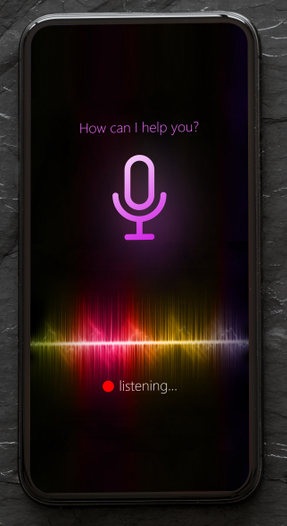
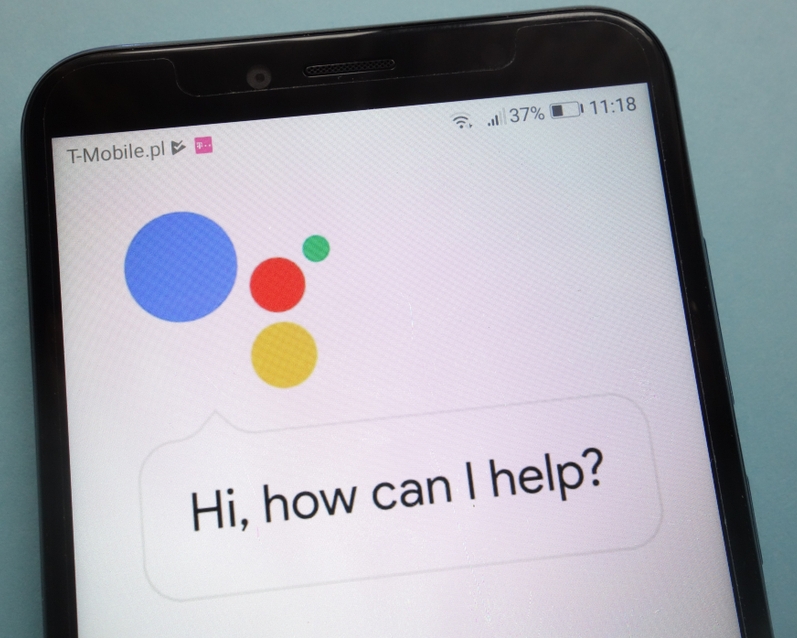

---
title: Den Talende Infoskærm
author: Bjarke, Jasper, Julius Westmann & Noah
date: 13-05-2019
titlepage: true
toc: true
lang: danish
...

\newpage

# Produktkoncept

## Problemformulering

Hvordan kan man lave et intelligent system som viser folk hvor de skal hen på offentlige steder ved brug af stemmegenkendelse?

### Underspørgsmål:

\- kan man lave systemet, så det kan fungerer som et plugin til eksisterende infoskærme?

\newpage

## Projektidé

Vores projekt består af en infoskærm som ved hjælp af stemmegenkendelse kan vise gæster vej til et lokale når man spørger. For eksempel kan man på en skole sige “rektors lokale” og så får man et kort der viser hen til rektors lokale. Produktet henvender sig altså generelt til publikum på offentlige steder hvor der i forvejen findes en digital infoskærm, specifikt til de besøgende der ikke kender skolen indvendigt. Primært til 1.g’er, idet de ikke kender skolen lige så godt som en 2.g’er eller en 3.g’er gør.

## Tematik

Titel: Den Talende Infoskærm \
Slogan: “Find din vej” \
Tematik: Talende/hjælpe teknologi.

### Stemmegenkendelse

Stemmegenkendelse er en maskines evne til at modtage og forstå diktering i form af talte kommandoer. Selve konceptet og teknologien der bruges i forbindelse med stemmegenkendelse har faktisk eksisteret i over fem årtier, men er først for nyligt begyndt at blive benyttet af den private forbruger. (Rouse, 2018)
Allerede i år 1976 var computere i stand til at forstå lidt over 1.000 ord, og i løbet af 1980’erne var dette antal steget til omkring 20.000 ord. Dog skulle der gå indtil år 1990 før privatpersoner fik adgang til at bruge teknologien. Det var nemlig i dette år at firmaet Dragon udviklede og solgte det første produkt der var i stand til at genkende og reagere på talte kommandoer. Produktet blev kaldt ‘DragonDictate’, og det var en revolution indenfor hvad computere var i stand til. Seks år senere udgav ‘IBM’ deres stemmegenkendelses-produkt, som var i stand til at modtage og forstå en hel sætning.
Siden 1990’erne er stemmegenkendelse blevet udviklet meget, og i dag kommer de fleste smartphones med indbygget stemmegenkendelse. To eksempler som stort set alle kender er ‘Siri’, som er udviklet af Apple, og ‘Google Assistant’, som er udviklet af Google. Billedet herunder til venstre viser ‘Siri’, og billedet herunder til højre viser ‘Google Assistant’.

\ 
