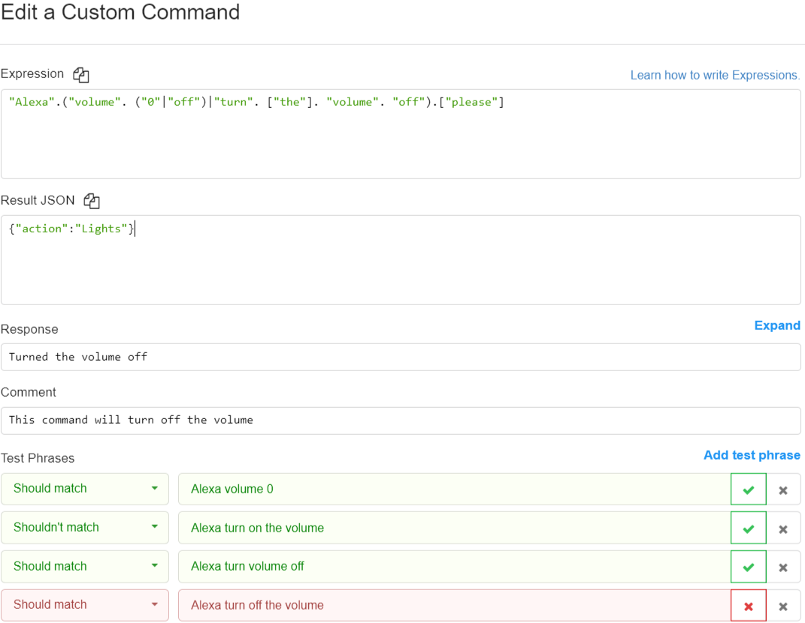
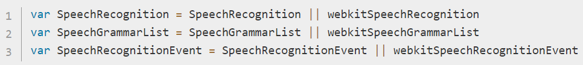
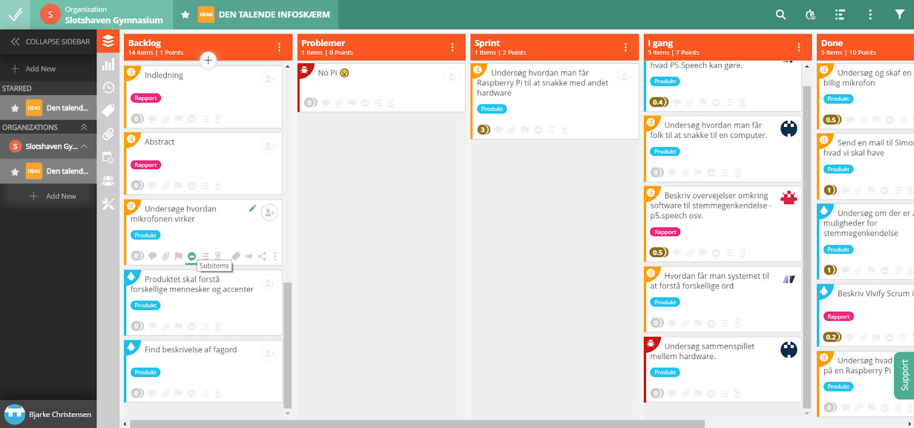
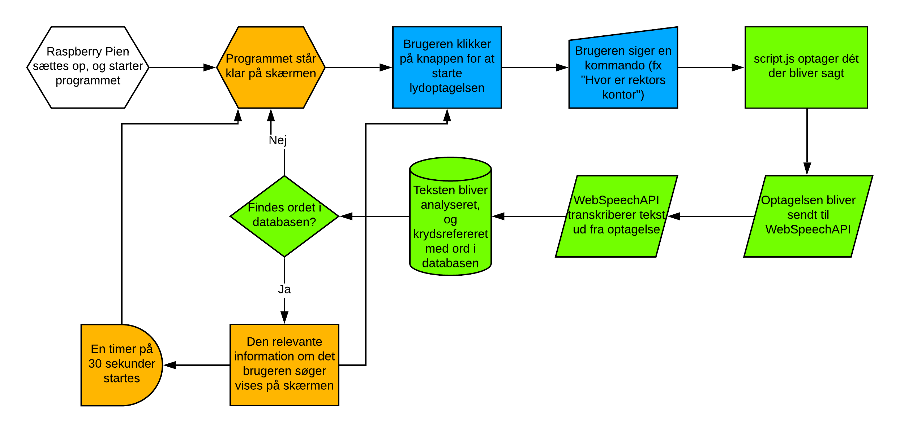

---
title: Den Talende Infoskærm
author: Bjarke, Jasper, Julius Westmann & Noah
date: 13-05-2019
titlepage: true
toc: true
toc-title: Indholdsfortegnelse
numbersections: true
lang: da
csl: apa.csl
bibliography: digitek.bib
nocite: |
    @*
...

\newpage

# Abstract

# Indledning

# Problemformulering

Hvordan kan man lave et intelligent system som viser folk hvor de skal hen på offentlige steder ved brug af stemmegenkendelse?

## Underspørgsmål:

\- kan man lave systemet, så det kan fungerer som et plugin til eksisterende infoskærme?

# Projektidé

Vores projekt består af en infoskærm som ved hjælp af stemmegenkendelse kan vise gæster vej til et lokale når man spørger. For eksempel kan man på en skole sige "rektors lokale" og så får man et kort der viser hen til rektors lokale.
Produktet henvender sig altså generelt til publikum på offentlige steder hvor der i forvejen findes en digital infoskærm, specifikt til de besøgende der ikke kender skolen indvendigt. Primært til 1.g’er, idet de ikke kender skolen lige så godt som en 2.g’er eller en 3.g’er gør.

# Tematik

Titel: Den Talende Infoskærm

Slogan: “Find din vej”

Tematik: Talende/hjælpe teknologi.

## Stemmegenkendelse

Stemmegenkendelse er en maskines evne til at modtage og forstå diktering i form af talte kommandoer. Selve konceptet og teknologien der bruges i forbindelse med stemmegenkendelse har faktisk eksisteret i over fem årtier, men er først for nyligt begyndt at blive benyttet af den private forbruger. (@voiceRecognitionSpeakerRecognition)
Allerede i år 1976 var computere i stand til at forstå lidt over 1.000 ord, og i løbet af 1980’erne var dette antal steget til omkring 20.000 ord. Dog skulle der gå indtil år 1990 før privatpersoner fik adgang til at bruge teknologien. Det var nemlig i dette år at firmaet Dragon udviklede og solgte det første produkt der var i stand til at genkende og reagere på talte kommandoer. Produktet blev kaldt *DragonDictate*, og det var en revolution indenfor hvad computere var i stand til.
Seks år senere udgav IBM deres stemmegenkendelses-produkt, som var i stand til at modtage og forstå en hel sætning.  Siden 1990’erne er stemmegenkendelse blevet udviklet meget, og i dag kommer de fleste smartphones med indbygget stemmegenkendelse.
To eksempler som stort set alle kender er *Siri*, som er udviklet af Apple, og *Google Assistant*, som er udviklet af Google. Billedet herunder til venstre viser *Siri*, og billedet herunder til højre viser *Google Assistant*.

{ width=30% }\ { width=69% }

En anden populær device som understøtter stemmegenkendelse er *Amazon Echo* som er udviklet af Amazon. Denne device er beregnet til at blive brugt i private hjem, og i starten af 2019 udsendte Amazon et indlæg til pressen om at de nu havde solgt over 100 millioner devices. (@Matney)
Når en computer skal foretage stemmegenkendelse sker der tre ting; først bliver det analoge signal i form at den menneskelige stemme omdannet til et digitalt signal som computeren kan forstå. Derefter bliver det digitale signal sendt gennem en form for database, som indeholder en stor mængde af ord. Hvis computeren er i stand til at matche det input den har fået med et ord i databasen, så vil dette ord blive sendt videre til det program som har efterspurgt et input i form at tale.
En visuel repræsentation af processen der foregår når en computer skal forsøge at tolke hvad der bliver sagt kan ses på billedet nedenfor.

Der er både mange fordele og ulemper ved brugen af stemmegenkendelse. Teknologien gør bl.a. private forbrugere i stand til at bruge deres stemme til at kontrollere mange forskellige smart-devices. Teknologien kan også blive brugt til at konvertere tale til tekst.
Der er dog også nogle ulemper ved stemmegenkendelse; på nuværende tidspunkt er teknologien stadig “relativt” ny, og derfor ikke perfekt. Dette gør, at hvis man forsøger at bruge stemmegenkendelse når der er baggrundsstøj, så er det ikke altid at computeren kan opfange hvad man siger. Stemmegenkendelse virker altså bedst i er stille rum uden baggrundsstøj, hvilket begrænser brugen af stemmegenkendelse en smule. 
Teknologien er også stadig så ny, at der nogle gange opstår problemer med ord der lyder ens. Dette kunne være ord såsom “hear” og “here”. Her er computeren ikke altid sikker på hvilket ord der er blevet sagt, og derfor kan en sætning blive opfattet forkert når den bliver sendt videre til programmet som har efterspurgt input i form af tale. Det er dog sandsynligt at disse “små” problemer vil blive løst med tiden, efterhånden som stemmegenkendelse bliver mere udviklet.
Vi kan altså forvente en forbedring i teknologien i fremtiden, og sandsynligvis en udryddelse af de småproblemer som teknologien har på nuværende tidspunkt.
I vores projekt skal vi bruge stemmegenkendelse som input, idet vores produkt skal fungere som en device man kan stille spørgsmål omkring skolen. Vi skal altså have fundet den bedste måde at opfange og analysere tale, og den bedste måde at implementere en database med svar til de spørgsmål som vores device bliver stillet.

# Tekniske udfordringer

- At lave et digitalt system, der er i stand til at opfange analog lyd og
omforme det til til en output som systemet kan forstå (i form af ord eller
sætninger).
- At skabe mening ud fra det:
  - At kende forskel på tal og ord.
  - At fortolke korte sætninger semantisk.
  - At kunne ignorere baggrundsstøj og snak.
- At bruge talegenkendelsen til at vise relevante information infoskærmen.
- Infoskærmen skal kunne aktiveres ved, at brugeren siger en specifik frase.
- At bruge en Raspberry Pi til at køre systemet og lyd inputtet, da den er lille og nemmere at programmere til det vi vil have, end en Arduino. Den har også en HDMI indgang, hvilket kan bruges til at koble den til infoskærmen/skærmen.

# Teknologier

Til at lave vores projekt skal vi bruge disse følgende ting:

## Raspberry Pi

Vi ville bruge en Raspberry Pi i stedet for at have en computer kørende ved siden af infoskærmen.
En Raspberry pi er en lille computer først lavet i 2012 af velgørenheden fra UK ‘The Raspberry Pi Foundation’ for at give flere personer muligheden for at kunne lære at programmere. Brugen af Raspberry Pi har dog overskredet den oprindelige målgruppe, og bliver idag brugt til mange forskellige formål.
Raspberry pi's er både små og relativt billige, for hvad de kan gøre, så de kan efterlades uden frygt for et stort tab. Dette er godt for offentlige institutioner da de let kan sættes ind i eksisterende teknologi, og hvis en person af mere tvivlsom karakter vælger at røve eller forårsage hærværk, bliver det ikke lige så stort et tab som hvis der var en rigtig computer kørende ved siden af.
Raspberry Pi’en skal have en mikrofon til at opfange lyd. Denne mikrofon er nødt til at være en ekstern mikrofon, da Raspberry Pi’en ikke har en indbygget mikrofon.
En Raspberry Pi understøtter mange forskellige kodesprog. Dette inkluderer Java, Python og C. En Raspberry Pi er derfor meget medgørlig når der kommer til hvilke programmer der kan køre på den.

## En infoskærm/normal skærm

Infoskærme er gode til at give information i steder med passerende trafik. De bliver mange gange brugt i stedet for mere traditionel skiltning da de er mere fleksible og giver mulighed for at involvere auditive og dynamiske visuelle elementer.
Infoskærme kan ændrer hvad de viser, hvilket giver mulighed for at man kan interagere med dem, hvis man har hardware og software til det. Dette kunne for eksempel være et eksternt eller internt system som opfangede lyd og kunne bestemme hvad infoskærmen viste baseret på lyden. En infoskærm ville være oplagt til vores projekt, men hvilken som helst stor skærm eller projektor med et HDMI-stik.

## Wekinator

Vi skal bruge Wekinator til at klassificere tale input for at vise de relevante informationer på infoskærmen.
Wekinator kan bl.a. bruges til at skabe et system som kan sende forskellige digitale outputs baseret på analog lyd.
Wekinator er et gratis, open source program først lavet af Rebecca Fiebrink i 2009, som får en maskine til at lære forskellige opgaver. Den gør dette ud fra en model baseret på træningsdata, den er blevet givet.

Når wekinator starter, kan man vælge hvilke porte den sender og modtager osc-beskeder, samt hvor mange inputs og outputs man forventer.

For at lave modellen som Wekinator bruger, ændrer man personligt på de outputs, man gerne vil have sendt ud samt de input, man giver den. Derefter trykker man på Record-knappen for at få Wekinator til at gemme værdierne. Mens man optager, kan man ændre på inputs, hvis man gerne vil have flere forskellige inputs til at gøre det samme.

Den træningsdata, man giver Wekinator, bliver lavet til en model baseret på hvilken form for lærings algoritme, den får.

Wekinputhelper bruges så wekinator kan bearbejde flere forskellige input som den har fået over tid. Man sender inputtet til Wekinputhelper først, som så bearbejde inputtene og sender et output til wekinator. Dette bruges så man kan få input fra hele ordet/sætningen så wekinator kan se forskel mellem ord der f. eks. ender med på samme lyd.

## Processing

Vi har brug for et system, der kan omforme analog input (i form af ord og sætninger) til et digitalt output som systemet kan forstå. 
Processing kan bruges til at programmere et system som kan snakke med Wekinator og hardware såsom en Arduino.
Processing er et programmeringssprog baseret på Java og er beregnet til programmeringsopgaver i et visuelt miljø kaldet skitser. Man kan dog også bruge Processing til alverdens programmeringsopgaver, især hvis man benytter ekstra biblioteker. Bibliotekerne kan tilføje nye funktionaliteter såsom OSC-kommunikation, webcam, lydafspilning, Arduino-kommunikation eller ansigtsgenkendelse. Den forenklede Java-syntaks gør Processing let at bruge til forholdsvis simple opgaver.

## p5.js

Systemet ville være nemmest at programmere i et browser miljø. Derfor ville
brugen af p5.js være hurtigere og nemmere.  p5.js er et JavaScript-fork af
Processing, som er bringer Processings funktionalitet ind i et
webbrowser-miljø. Ligesom Processing har p5.js libraries, som kan udvide dets
funktionalitet.

p5.speech er et library, der giver en tydelig adgang til Web Speech og Speech
Recognition API’erne.

RiTa.js er et software library lavet af Daniel Howe som kan bruges med flere
forskellige platforme som for eksempel JavaScript. RiTa bruges til
computational literature.

## Houndify

Houndify er et API designet til at give stemme og stemmegenkendelse til alle mulige forskellige produkter som har adgang til internettet. Den giver en simpel måde at tilføje ens egne kommandoer til stemmegenkendelses systemet.

For at lave sin egen stemmegenkendelse  skal man skrive hvert ord separeret med et punktum.  Hvis to forskellige ord eller sætninger kan bruges, sætter man parentes omkring dem og deler dem med en lodret streg. Hvis et ord ikke er nødvendigt at sige, sætter man det ind i brackets.
Houndify returnere et JSON respons ved korrekt udtryk.
Man kan teste hvilke sætninger som udtrykket accepterer ved at skrive en sætning og sige om det burde eller ikke burde returnerer true.

## Web speech API

Web speech API giver mulighed for at arbejde med stemmegenkendelse i javascript og er indbygget i flere forskellige webbrowsere som chrome og firefox. Det blev lavet af w3c i 2012 og er blevet opdateret af dem siden da.
API’et kan gøre to ting. Den kan lave stemmegenkendelse og “text to speech” (tts). Vi skal kun bruge stemmegenkendelses delen. Vi har kun brug for stemmegenkendelses delen.
For at bruge stemmegenkendelsen skal vi have fat i det interface som hedder “SpeechRecognition”. Chrome har deres eget navn på interfacet. De sætter “webkit” foran, så man skal sørge for at det er det rigtige navn som bliver valgt, alt efter hvad man bruger.

For at bruge SpeechRecognition skal man først constructe en ny SpeechRecognition instans. Ved lyd skal den startes med metoden “SpeechRecognition.start()”.
Speechrecognition har en liste af egenskaber som kan hænge sammen med et event. For at starte et event når SpeechRecognition genkender et ord, skal den egenskab som hedder “onresult”, bruges. For at bestemme hvilket sprog SpeechRecognition lytter efter skal egenskaben “lang” sættes til et “BCP 47 tag”, som er en måde at klassificere forskellige sprog og sprogvarianter (dansk er “DA”).

## Vivify Scrum

Vivify Scrum er et program på en hjemmeside som hjælper gruppemedlemmerne med at holde styr på det der skal laves i projektet. Vivify Scrum fungerer ved at man har en backlog med alle de issues sim der på et tidspunkt skal arbejdes på. En issue i backloggen kan flyttes til den såkaldte ‘Sprint’, hvor de issues der fokuseres på i øjeblikket befinder sig. En issue kan så igen flyttes til ‘I gang’, hvilket betyder at det pågældende issue er i gang med at blive løst. Når man har løst et issue, kan det flyttes til ‘Done’. Når et issue er i denne gruppe er det løst, og man kan gå videre til et andet issue.
Vivify Scrum giver også gruppemedlemmerne mulighed for at tildele opgaver til sig selv, eller til andre i gruppen. Dette gør at man hele tiden har styr på hvem der laver hvad, og er også med til at sikre at der hele tiden bliver arbejdet på projektet.
Vi har desuden tilføjet en gruppe til de problemer der opstår i vores arbejdsprocess. Vi kan derfor hele tiden observere om vi har nogle problemer med projektet, og aktivt arbejde på at løse disse problemer. Billedet nedenfor viser hvordan Vivify Scrum virker. På billeder kan vores Backlog, Sprint, I gang, og Done grupper ses.

## Figma

Figma er et online tegneprogram som vi bruger til at lave vores kort. Selve programmet indeholder ikke en stor mængde features, men indeholder dog det vi skal bruge til at lave vores kort.
I starten havde vi planlagt at bruge programmer som Photoshop til at lave vores kort, men disse programmer er alt for avancerede, og derfor svære at bruge til at lave noget relativt simpelt som vores kort. Vi valgte derfor at bruge Figma til at lave vores kort.

## Adobe XD

Adobe XD er et designprogram som er udgivet af Adobe. Selve programmet fungere stort set ligesom Figma, men indeholder dog en del flere funktioner. Vi valgte at bruge Adobe XD til at lave vores designs til forsiden på vores produkt, idet vi følte at funktionaliteten i Figma ikke var tilstrækkelig til at skabe vores forside.
Adobe XD gjorde det også nemt at sammenligne designs, idet programmet understøtter arbejde på flere forskellige designs samtidigt.

## GitHub

GitHub er et online lagringssystem som vi bruger til at opbevare de filer vi arbejder med. GitHub fungerer via såkaldte “repositories”, som vi kan uploade og downloade filer fra. Til at uploade og downloade filer fra vores repository bruger vi GitHub Desktop. Når vi uploader filer til vores repository, pakker vi dem i såkaldte “commits”, som vi derefter pusher til vores repository. Sammen med vores commits følger en beskrivelse af indholdet, så de andre i gruppen ved hvad der er blevet arbejdet på.
Idet vi arbejder i grupper i dette eksamensprojekt, er det smart at alle har de filer der arbejdes på. GitHub gør os i stand til hele tiden at være opdaterede på det de forskellige gruppemedlemmer er i gang med at arbejde på, og gør os i stand til at arbejde videre på det en anden har arbejdet på.

### GitHub Pages

GitHub Pages er en udvidelse til GitHub der gør os i stand til at udgive vores projekt på nettet. Når GitHub Pages er blevet sat op, kan projektet tilgås og køres ved at besøge en url frem for at køre projektet på sin egen computer. Dette er en stor fordel for os idet vi arbejder med en Raspberry Pi, som har en begrænset mængde af lagringsplads. En anden fordel er at vi ikke er nødt til at opdatere softwaren der kører vores projekt på Raspberry Pi’en, idet det hele kører over en webserver.

# Anvendelse, Målgruppe og Mockup

## Målgruppe

Ofte sker det at man møder op på offentlig institution (som eksempel et museum eller et bibliotek), hvor man ikke kan finde ud af, hvor man skal hen for at finde det man søger, derfor er der blevet sat infoskærme op så man kan nemmere finde rundt.
Desværre er de fleste infoskærme alt for avancerede eller fyldt med for mange menuer så man ikke kan finde rundt i. Derfor ville det være nemmere hvis man bare kunne sige højt hvad man leder efter og så den viser dig det. Det er det vi har valgt at tage fat i ved at lave vores “user friendly” infoskærm, hvor det eneste man skal gøre er at sige hvor man skal hen og så viser den et kort over området og viser hvor du skal gå hen.
Vi har dog valgt at indsnævre målgruppen til skolens elever og dens besøgende, så vi kan have et startpunkt for produktet, så man kan nemt finde rundt på skolens grund.

## Anvendelse/use-case

Et eksempel på en anvendelse af skærmen er når en brobygger ved navn John skal på skolen sammen med sine venner. Problemet er at John mødte for sent, så han ved ikke hvor klassen befinder sig. Han ved at de skal være i et lokale der hedder “Innolab 3” men han ved ikke det ligger henne på skolen.
John ser en skærm som siger at man kan spørger den om vej, så han går hen og spørg “Hvor er Innolab 3?” hvorefter skærmen viser et kort over skolen med en rød cirkel over “innolab 3”. John fandt så lokalet og deltog i undervisningen. Hvis ikke han havde fundet lokalet, havde han aldrig valgt HTX.

## Mockup

{ width=50% }

{ width=50% }

Som billederne ovenover viser, så vil skærmen vise en besked hvorpå der fx står “Hvor skal du hen? Sig f.eks “Hvor er rektors kontor”, og så vil jeg vise dig vej” hvorefter den viser kortet og lokalisationen af det søgte lokale.
Tegningen er meget basal, efter som der ikke er så meget visuelt at så andet end det der foregår på skærmen.

## Kravspecifikation

Vi skal have en lydgenkendelse som kan forstå alle lokalerne. Dette indebære at den skal kunne kende forskel på tal og ord. Den skal også være i stand til at kunne forstå hvad der bliver sagt, selvom der er baggrundsstøj i form af andre folk der taler.
Den skal kunne fremvise forskellige kort, fra en stor database, alt efter hvad man siger.

|      **Krav**     |                                           **Beskrivelse**                                           |       **Testmetode**         |
|:-----------------:|:---------------------------------------------------------------------------------------------------:|:----------------------------:|
|    Bagrundsstøj   |          At systemet skal kunne høre personen der snakker, selv om der er støj i baggrunden         |        Programmatisk         |
|     Tydelighed    |           Systemet skal vise vej på en tydelig måde, og det skal kunne være til at forstå           |         Kvalitativ           |
|   Imødekommende   |                Man skal kunne se præcist hvad man skal gøre for at aktivere systemet                |         Kvalitativ           |
|     Aktivering    |                   Systemet skal kunne aktiveres ved at man siger en specifik frase                  |   Kvantitativ & Kvalitativ   |
|     Forståelse    |        Systemet skal være i stand til at opfange hvad der bliver sagt, og agere som den skal        |        Programmatisk         |
|      Samspil      |   Samspillet mellem teknologierne skal være hurtigt og effektivt så folk ved at den opfattede det   |        Programmatisk         |

# Problemanalyse

I forbindelse med udviklingen af vores produkt overvejede vi at bruge flere forskellige løsningsmetoder til at kunne genkende ord. Disse er:
- Wekinator med processing
- Houndify
- p5.speech

Med Wekinator kan vi lave vores eget stemmegenkendelses system. Dette giver mulighed for at customize hvad system forstår og arbejder med. Dette kræver dog meget arbejde for at kunne fungere. Der skal være et system som sender osc-beskeder alt efter hvilke lyde man laver, Wekinputhelper skal kunne finde ud af hvornår de værdier den får er et ord og Wekinator skal trænes til at kunne forstå alle navnene på lokalerne.
Alle de forskellige dele er et ekstra sted som skal arbejdes på og som kan være upræcis. Der findes allerede systemer på internettet som kan downloades og som gør det samme.

Houndify fungerer godt til at skabe kommandoer med stemmegenkendelse. Det giver dog problemer når man skal tage højde for alle de forskellige sætninger som en person kan bruge til at udtrykke det samme. Houndify fungere også kun på engelsk og det er en dansk skole vi arbejder med.

p5.speech kan opfange ord præcist nok til vores formål og det er let at integrere i et browser miljø da p5 er javascript. Desuden virker p5.speech på dansk. Vi har valgt at bruge p5.speech.

# Produktudformning

## Flowchart

Nedenstående billede viser et Flowchart der beskriver hvordan vores produkt skal fungere. De gule elementer beskriver de steder hvor der sker noget på selve infoskærmen, de blå elementer beskriver input fra brugeren, og de grønne elementer beskriver ting der sker i baggrunden af programmet (altså i selve koden).

## Test 1

## Test 2

# Tidsplan

**21/03**	\- Problem Undersøgelse

**28/03**	\- Undersøge hardware

**02/04**	\- Indsamling af hardware

**04/04**	\- Lav stemmegenkendelse

**18/04**	\- Skab kommunikation mellem stemmegenkendelse og infoskærm

**25/04**	\- Designe infoskærmens struktur

**30/04**	\- Implementering

**02/05**	\- Test

**07/05**	\- Rapportskrivning

**12/05**	\- Finpudsning af rapport

# Litteraturliste
