---
title: Den Talende Infoskærm
author: Bjarke, Jasper, Julius Westmann & Noah
date: 13-05-2019
titlepage: true
toc: true
toc-title: Indholdsfortegnelse
numbersections: true
lang: da
csl: apa.csl
bibliography: digitek.bib
nocite: |
    @*
...

\newpage

# Abstract

A problem with large organisational buildings with different people doing different things, is that the layout of the building can be confusing to people who don’t know the building very well. A map offers a way to find out where a person needs to go, but they are also cluttered with information that one person wouldn’t need, but that other people might. By using speech recognition in conjunction with info screens, we are able give clear instructions on where to go, without having to look at the screen for very long. The speech recognition is achieved by using the SpeechRecognition part of the Web Speech API. This interface uses a neural network to figure out what people are saying. SpeechRecognition only works on Chrome-based browsers, and Safari. We decided to use the Chrome-based browser called “Chromium” in our project. The computing is done by a Raspberry Pi 3 Model B, which is kept in a holder, that also houses the microphone used for speech recognition.

# Indledning

Slotshaven gymnasium har for nyligt fået installeret tre touchskærme rundt omkring på skolen. Der er dog aldrig rigtigt blevet givet nogen grund til at disse skulle indkøbes og sættes op, og de bliver på nuværende tidspunkt blot brugt af eleverne til at spille spil og vise videoer på. Dette er dog langt fra hvad touchskærmene er i stand til at gøre, og på nuværende tidspunkt bliver deres potentiale ikke udnyttet fuldt ud.
Vi valgte at give en bedre udnyttelse til infoskærmene i vores projekt, hvor vi forsøger at takle det problem som nogle besøgende på Slotshaven gymnasium oplever, når de leder efter et sted på skolen; de kan ikke finde det. De opsatte touchskærme er oplagte til at give informationer til de besøgende på Slotshaven gymnasium, idet man naturligt vil kigge efter en stor skærm med informationer, når man søger noget specifikt på et offentligt sted. F.eks.. benytter sygehuse og borgerservice store skærme til at give informationer til de brugere der ønsker dem.
Målet for vores projekt er at lave et produkt som er i stand til at forstå indtalte kommandoer i form af spørgsmål omkring lokationen på forskellige lokaler på Slotshaven gymnasium, og som kan give informationer omkring disse lokaler, samt give en detaljeret rutevejledning til det pågældende lokale.

# Problemanalyse

Det er vigtigt at eleverne og andre besøgende på et gymnasium er i stand til at finde rundt på uddannelsesstedet. Dette kan dog sommetider være svært, idet mange uddannelsessteder spreder sig over store arealer, med mange forskellige lokaler. Det er derfor vigtigt at uddannelsesstederne udvikler løsninger der hjælper eleverne og andre besøgende med at finde rundt på stedet. Hvis dette ikke sker, er der stor sandsynlighed for at besøgende på uddannelsesstederne ikke kan finde rundt på stedet, og derfor ikke får fundet det lokale eller den person de søgte, da de ankom på uddannelsesstedet.

\newpage

## Eksisterende løsninger

Der findes allerede eksisterende løsninger på skolen, som skal hjælpe elever og besøgende med at finde rundt. Der er kort placeret rundt omkring på skolen, der er et kort på skolens hjemmeside, og man kan spørge folk som kender skolen bedre.

{ width=50% }

Disse løsninger har dog deres egne problemer. Kortene på skolen er placeret i hjørner og forskellige steder hvor de er af vejen. Desuden er de ikke særlig store, hvilket gør dem svære at spotte. Et normalt kort indeholder også en masse information som man ikke skal bruge, da de er nødt til at vise vej til alle lokaler.

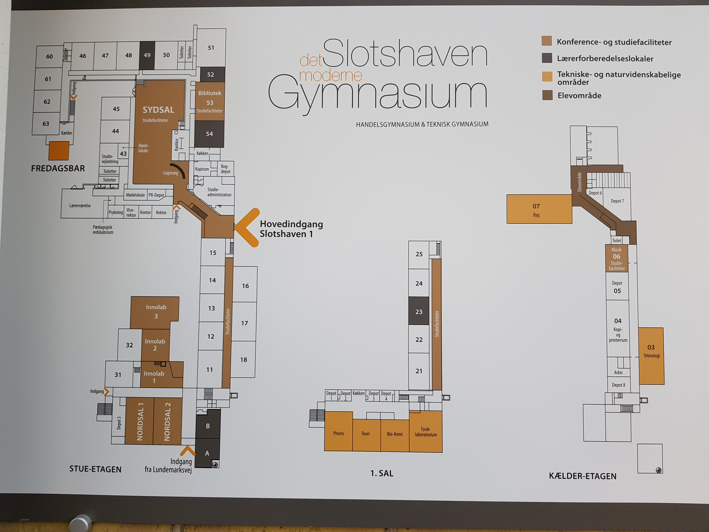{ width=50% }

Disse kort er heller ikke opdaterede, så de viser ikke nye lokaler såsom VR-Lab.
Kortet på skolens hjemmeside er heller ikke opdateret. Dette kan findes under menuen “om os”, som den anden sidste undermenu, med 12 andre undermenuer, med navnet “Lokaleoversigt”. Hvis man ikke ved hvor man skal lede, kan det tage et stykke tid at finde kortet. Det fremgår altså ikke klart nok, at hjemmesiden indeholder et kort over skolen.
Både de fysiske kort og kortet på skolens hjemmeside giver ikke god mulighed for at få kendskab til de lokaler, man ikke kender i forvejen.

## Stemmegenkendelse

I forbindelse med udviklingen af vores produkt overvejede vi at bruge flere forskellige løsningsmetoder til at kunne genkende ord. Disse er:

* Wekinator og Processing
* Houndify
* p5.speech
* Web Speech API

Med Wekinator kan vi lave vores eget stemmegenkendelses system. Dette giver mulighed for at tilpasse hvad systemet skal kunne forstå og arbejde med. Dette kræver dog meget arbejde for at kunne fungere. Der skal være et system som sender osc-beskeder alt efter hvilke lyde man laver, Wekinputhelper skal kunne finde ud af hvornår de værdier den får, er et ord, og Wekinator skal trænes til at kunne forstå alle navnene på lokalerne.
Alle de forskellige dele er et ekstra sted som der skal arbejdes på, og som kan være upræcis. Der findes allerede systemer på internettet som kan downloades, og som gør det samme.

Houndify fungerer godt til at skabe kommandoer med stemmegenkendelse. Det giver dog problemer når man skal tage højde for alle de forskellige sætninger, som en person kan bruge til at udtrykke det samme. Houndify fungerer også kun på engelsk, og det er en dansk skole vi arbejder med i vores projekt.

p5.speech kan opfange ord præcist nok til vores formål, og det er let at integrere i et browser miljø da p5 er javascript. Desuden virker p5.speech på dansk.

# Problemformulering

Hvordan kan man lave et intelligent system som viser folk hvor de skal hen på offentlige steder ved brug af stemmegenkendelse?

**Underspørgsmål**

\- kan man lave systemet, så det kan fungerer som et plugin til eksisterende infoskærme?

# Projektidé

Vores projekt består af en infoskærm som ved hjælp af stemmegenkendelse kan vise gæster på et uddannelsessted vej til et lokale når man spørger. For eksempel kan man på en skole sige “rektors kontor”, og så får man et kort der viser vej til rektors kontor.
Produktet henvender sig altså generelt til publikum på offentlige steder, hvor der i forvejen findes en digital infoskærm - specifikt til de besøgende der ikke kender skolen indvendigt. Vi har valgt at udvikle vores produkt, så det kan vise rundt på vores egen skole; Slotshaven Gymnasium. Da vores produkt er udviklet så det kan vise rundt på et gymnasium, er vores primære målgruppe 1.g’er, idet de ikke kender skolen lige så godt som en 2.g’er eller en 3.g’er gør.

# Tematik

Titel: Den Talende Infoskærm

Slogan: “Find din vej”

Tematik: Talende/hjælpe teknologi.

## Stemmegenkendelse

Stemmegenkendelse er en maskines evne til at modtage og forstå diktering i form af talte kommandoer. Selve konceptet og teknologien der bruges i forbindelse med stemmegenkendelse har faktisk eksisteret i over fem årtier, men er først for nyligt begyndt at blive benyttet af den private forbruger. (@voiceRecognitionSpeakerRecognition)
Allerede i år 1976 var computere i stand til at forstå lidt over 1.000 ord, og i løbet af 1980’erne var dette antal steget til omkring 20.000 ord. Dog skulle der gå indtil år 1990 før privatpersoner fik adgang til at bruge teknologien. Det var nemlig i dette år at firmaet Dragon udviklede og solgte det første produkt der var i stand til at genkende og reagere på talte kommandoer. Produktet blev kaldt *DragonDictate*, og det var en revolution indenfor hvad computere var i stand til. Seks år senere udgav IBM deres stemmegenkendelses-produkt, som var i stand til at modtage og forstå en hel sætning.
Siden 1990’erne er stemmegenkendelse blevet udviklet meget, og i dag kommer de fleste smartphones med indbygget stemmegenkendelse. To eksempler som stort set alle kender er *Siri*, som er udviklet af Apple, og *Google Assistant*, som er udviklet af Google. Billedet herunder til venstre viser *Siri*, og billedet herunder til højre viser *Google Assistant*.

{ width=30% }\ { width=69% }

En anden populær device som understøtter stemmegenkendelse er *Amazon Echo*, som er udviklet af Amazon. Denne device er beregnet til at blive brugt i private hjem, og i starten af 2019 udsendte Amazon et indlæg til pressen om at de nu havde solgt over 100 millioner devices. (@Matney)
Når en computer skal foretage stemmegenkendelse, sker der tre ting; først bliver det analoge signal i form at den menneskelige stemme omdannet til et digitalt signal, som computeren kan forstå. Derefter bliver det digitale signal sendt gennem en form for database, som indeholder en stor mængde af ord. Hvis computeren er i stand til at matche det input den har fået med et ord i databasen, så vil dette ord blive sendt videre til det program som har efterspurgt et input i form at tale. En visuel repræsentation af processen der foregår når en computer skal forsøge at tolke hvad der bliver sagt kan ses på billedet nedenfor.

Der er både mange fordele og ulemper ved brugen af stemmegenkendelse. Teknologien gør bl.a. private forbrugere i stand til at bruge deres stemme til at kontrollere mange forskellige smart-devices. Teknologien kan også blive brugt til at konvertere tale til tekst. Der er dog også nogle ulemper ved stemmegenkendelse; på nuværende tidspunkt er teknologien stadig “relativt” ny, og derfor ikke perfekt. Dette gør, at hvis man forsøger at bruge stemmegenkendelse når der er baggrundsstøj, så er det ikke altid at computeren er i stand til at opfange hvad man siger. Stemmegenkendelse virker altså bedst i et stille rum uden baggrundsstøj, hvilket begrænser brugen af stemmegenkendelse en smule. Teknologien er også stadig så ny, at der nogle gange opstår problemer med ord der lyder ens. Dette kunne være ord såsom “hear” og “here”. Her er computeren ikke altid sikker på hvilket ord der er blevet sagt, og derfor kan en sætning blive opfattet forkert, når den bliver sendt videre til programmet som har efterspurgt input i form af tale. Det er dog sandsynligt at disse “små” problemer vil blive løst med tiden, efterhånden som stemmegenkendelse bliver mere udviklet. Vi kan altså forvente en forbedring i teknologien i fremtiden, og sandsynligvis en udryddelse af de småproblemer som teknologien har på nuværende tidspunkt.
I vores projekt skal vi bruge stemmegenkendelse som input, idet vores produkt skal fungere som en device man kan snakke til, og stille spørgsmål omkring skolen. Vi skal altså have fundet den bedste måde at opfange og analysere tale, og den bedste måde at implementere en database med svar til de spørgsmål som vores device bliver stillet. Det er vigtigt at vi finder den bedste metode til stemmegenkendelse, idet vores produkt skal opfange, analysere, og processere en brugers stemme og tilhørende spørgsmål uden nogen forsinkelse. Hvis vi ikke formår at gøre dette, ville der opstå en unødvendig forsinkelse mellem at brugeren stiller et spørgsmål, og at svaret på det pågældende spørgsmål vises på skærmen. Dette skal undgås, idet brugeren muligvis ville tænke at produktet ikke virkede, eller at brugeren ville blive for utålmodig og derfor ikke ville benytte produktet.

# Tekniske udfordringer

Der findes en del tekniske udfordringer der opstår når man sætter sig for at lave et produkt som indebærer brugen af stemmegenkendelse. Disse er som følger:

- At lave et digitalt system der er i stand til at opfange analog lyd, og omforme det til et output som systemet kan forstå (i form af ord eller sætninger).
- At skabe mening ud fra det:
  - At kende forskel på tal og ord.
  - At fortolke korte sætninger semantisk.
  - At kunne ignorere baggrundsstøj og snak.
- At bruge talegenkendelsen til at vise relevante informationer på infoskærmen.
- Infoskærmen skal kunne aktiveres ved at brugeren siger en specifik frase.
- At bruge en Raspberry Pi til at køre systemet og lyd inputtet.

\newpage

# Teknologier

## Raspberry Pi

Vi ville bruge en Raspberry Pi i stedet for at have en computer kørende ved siden af infoskærmen.
En Raspberry Pi er en lille computer, først lavet i 2012 af velgørenheden fra UK ‘The Raspberry Pi Foundation’, med formålet at give flere personer muligheden for at lære at programmere. Brugen af Raspberry Pi har dog overskredet den oprindelige målgruppe, og bliver i dag brugt til mange forskellige formål.
Raspberry Pies er både små og relativt billige for hvad de kan gøre, så de kan efterlades uden frygt for et stort tab. Dette er godt for offentlige institutioner, da de let kan sættes ind i eksisterende teknologi, og hvis en person af mere tvivlsom karakter vælger at røve eller forårsage hærværk, bliver det ikke lige så stort et tab som hvis der var en ordinær computer kørende ved siden af.
Raspberry Pien skal have en mikrofon til at opfange lyd. Denne mikrofon er nødt til at være en ekstern mikrofon, da Raspberry Pien ikke har en indbygget mikrofon.
En Raspberry Pi understøtter mange forskellige kodesprog. Dette inkluderer Java, Python og C. En Raspberry Pi er derfor meget medgørlig, når der kommer til hvilke programmer der kan køre på den. Til vores projekt bruger vi den tredje version af Raspberry Pi, kaldet Raspberry Pi 3 Model B. Denne version af Raspberry Pi er den nyest udgivne version af Raspberry Pi, og blev udgivet i februar 2018.
Et billede af en Raspberry Pi 3 Model B kan ses nedenfor:

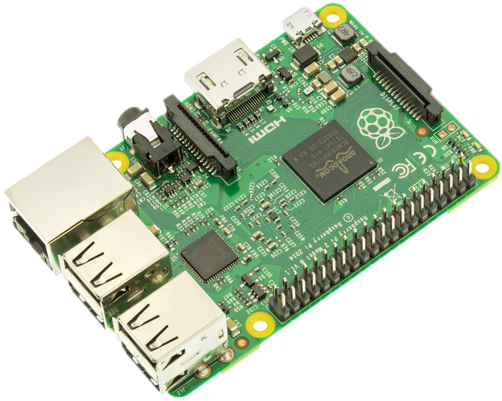{ width=50% }

### Raspbian

Raspbian er et af Raspberry Pi Foundations officielle operativsystem, som er blevet udviklet specielt til Raspberry Pi’ens hardware-specifikationer. Operativsystemet er baseret på Linux-distributionen Debian, så filsystemet følger den traditionelle Linux-filstruktur. Der er derfor også adgang til til de fleste af software-pakkerne, som ligger i Debians officielle repositories.
Raspbian installeres fra et SD-kort, hvor installeren guider brugeren gennem installationsprocessen. For at bruge den grafiske brugerflade (GUI) i stedet for Linux-terminalen, skal man installere en X Window Server, så visuelle programmer som internetbrowsere kan benyttes. Netop Chromium-browseren er optimal for vores projekt, da den understøtter Web Speech API’et. Derudover kan Chromium også startes uden toolbars og andre eksterne GUI-elementer, og dermed imitere et stand-alone program. Dog beholder den stadig basale internetbrowser-egenskaber såsom genindlæsning af hjemmesiden.
Denne fremgangsmåde gør det muligt kun at bruge systemets ressourcer på de nødvendige programmer, som til gengæld kan bruge flere af disse ressourcer. I dette tilfælde vil mere systemets hukommelse (RAM) blive tilgængeligt for browseren.

## En infoskærm/normal skærm

Infoskærme er gode til at give information på steder med passerende trafik. De bliver mange gange brugt i stedet for mere traditionel skiltning, da de er mere fleksible, og giver mulighed for at involvere auditive og dynamiske visuelle elementer.
Infoskærme kan ændre hvad de viser, hvilket giver mulighed for at man kan interagere med dem, hvis man har hardware og software til det. Dette kunne for eksempel være et eksternt eller internt system som opfangede lyd, og kunne bestemme hvad infoskærmen viste baseret på lyden. En infoskærm ville være oplagt til vores projekt, idet den er i stand til at vise input fra en ekstern device, og fordi den understøtter touch-funktionalitet.
Vi valgte at bruge en infoskærm fra *Clevertouch* til vores projekt, idet disse allerede er opsat rundt omkring på skolen. Disse infoskærme kører Android 5.0.0 som standard, men har mulighed for at vise input fra en anden device ved brug af et HDMI stik. Når infoskærmen bruger sine standardindstillinger, og kører Android 5.0.0, er infoskærmen meget begrænset i sin funktionalitet. Hvis man derimod kører et program på en anden device, og overfører det visuelle output til infoskærmen via et HDMI stik, bliver infoskærmen langt mere aktuel at bruge, idet man kan benytte processorkraften fra den anden device til at køre det program eller den website man ønsker at vise på infoskærmen. Et billede af infoskærmen fra *Clevertouch* kan ses nedenfor:

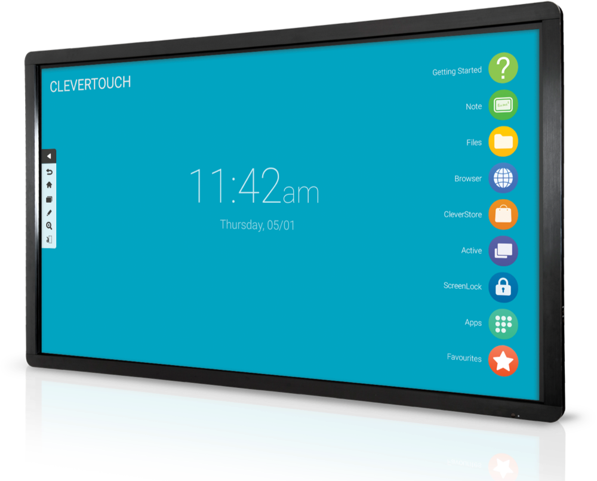{ width=50% }

\newpage

## Wekinator

Vi skal bruge Wekinator til at klassificere tale input for at vise de relevante informationer på infoskærmen.
Wekinator kan bl.a. bruges til at skabe et system, som kan sende forskellige digitale outputs baseret på analog lyd.
Wekinator er et gratis, open source program, først lavet af Rebecca Fiebrink i 2009, som får en maskine til at lære forskellige opgaver. Den gør dette ud fra en model baseret på træningsdata, den er blevet givet.

Når wekinator starter, kan man vælge hvilke porte den sender og modtager osc-beskeder på, samt hvor mange inputs og outputs man forventer.

For at lave modellen som Wekinator bruger ændrer man på de outputs man gerne vil have sendt ud, samt de input man giver den. Derefter trykker man på Record-knappen for at få Wekinator til at gemme værdierne. Mens man optager, kan man ændre på inputs, hvis man gerne vil have flere forskellige inputs til at gøre det samme.

Den træningsdata man giver Wekinator bliver lavet til en model baseret på hvilken form for lærings algoritme den får.

Wekinputhelper bruges så Wekinator kan bearbejde flere forskellige input som den har fået over tid. Man sender inputtet til Wekinputhelper først, som derefter bearbejder inputtene, og sender et output til Wekinator. Dette bruges så man kan få input fra hele ordet/sætningen, så wekinator er i stand til at se forskel mellem ord der f.eks. ender på samme lyd.

## Processing

Vi har brug for et system, der kan omforme analog input (i form af ord og sætninger) til et digitalt output som systemet kan forstå.
Processing kan bruges til at programmere et system som kan snakke med Wekinator og hardware såsom en Arduino.
Processing er et programmeringssprog baseret på Java, og er beregnet til programmeringsopgaver i et visuelt miljø kaldet skitser. Man kan dog også bruge Processing til alverdens programmeringsopgaver, især hvis man benytter ekstra biblioteker. Bibliotekerne kan tilføje nye funktionaliteter såsom OSC-kommunikation, webcam-funktionalitet, lydafspilning, Arduino-kommunikation og ansigtsgenkendelse. Den forenklede Java-syntaks gør Processing let at bruge til forholdsvis simple opgaver.

## p5.js

Systemet ville være nemmest at programmere i et browser miljø, idet det i sidste ende skal køres på en Raspberry Pi. Derfor ville brugen af p5.js være hurtigere og nemmere.
p5.js er et JavaScript-fork af Processing, som bringer Processings funktionalitet ind i et webbrowser-miljø. Ligesom Processing har p5.js libraries, som kan udvide dets funktionalitet.

p5.speech er et library der giver en tydelig adgang til Web Speech og Speech Recognition API’erne. Disse API’er kan også bruges seperat fra p5.speech.
Man kan vælge enkelte sprog for at afgrænse sine resultater.

RiTa.js er et software library udviklet af Daniel Howe, som kan bruges med flere forskellige platforme såsom JavaScript. RiTa.js bruges til computational literature.

## Houndify

Houndify er et API designet til at give talesyntese og stemmegenkendelse til alle mulige forskellige produkter, som har adgang til internettet. Houndify giver en simpel måde at tilføje ens egne kommandoer til stemmegenkendelses systemet.

For at lave sin egen stemmegenkendelse skal man skrive hvert ord separeret med et punktum.  Hvis man ønsker at to forskellige ord eller sætninger kan bruges, sætter man parentes omkring dem, og deler dem med en lodret streg. Hvis et ord ikke er nødvendigt at sige, sætter man klammer omkring.
Houndify returnerer en JSON-respons når den genkender et udtryk.
Man kan teste hvilke sætninger som udtrykket accepterer ved at skrive en sætning, og indikere om den indtastede sætning burde eller ikke burde returnere true.

## Web speech API

Web Speech API giver mulighed for at arbejde med stemmegenkendelse i Javascript, og er indbygget i flere forskellige browsere så som Chrome og Firefox. Det blev lavet af Speech API Community Group i 2012, og er blevet opdateret af dem siden da.
API’et kan gøre to ting: Den kan lave stemmegenkendelse og “text to speech” (tts). Vi skal dog kun bruge stemmegenkendelses delen til vores projekt.
For at bruge stemmegenkendelsen skal vi have fat i det interface som hedder “SpeechRecognition”, hvilket kun virker på Chrome-baserede browsere. Chrome har deres eget navn på interfacet. De sætter “webkit” foran, så man skal sørge for at det er det rigtige navn som bliver valgt, alt efter hvad man bruger.

For at bruge SpeechRecognition skal man først constructe en ny SpeechRecognition instans. Ved lyd skal den startes med metoden “SpeechRecognition.start()”.
Speechrecognition har en liste af egenskaber, som kan hænge sammen med en event. For at starte en event når SpeechRecognition genkender et ord, skal den egenskab som hedder “onresult” bruges. For at bestemme hvilket sprog SpeechRecognition lytter efter, skal egenskaben “lang” sættes til et “BCP 47 tag”, som er en måde at klassificere forskellige sprog og sprogvarianter. I vores projekt skal vi bruge det danske sprog, hvilket betyder at vi skal sætte “lang” til “DA”.

### Det neurale netværk

Vi antager at, når SpeechRecognition kører bruger den et Bidirectional Recurring Neural Network (BRNN), til at bestemme hvilke ord der er størst sandsynlighed for at man har sagt, ud fra om sætningen giver grammatisk mening i den pågældende kontekst. Dette bliver antaget, fordi SpeechRecognition ændrer det ord den tror man siger, baseret både på ordene man har sagt før, og ordene man siger efter det pågældende ord. Ydermere antager vi at Connectionist Temporal Classification (CTC) bliver brugt til at forstå ord, selvom at der er forskel på tiden brugt.
BRNN er en version af et neuralt netværk. Et neuralt netværk består af et input lag, et output lag, og en serie af gemte lag imellem. Nedenstående billede viser en illustration af et neuralt netværk.

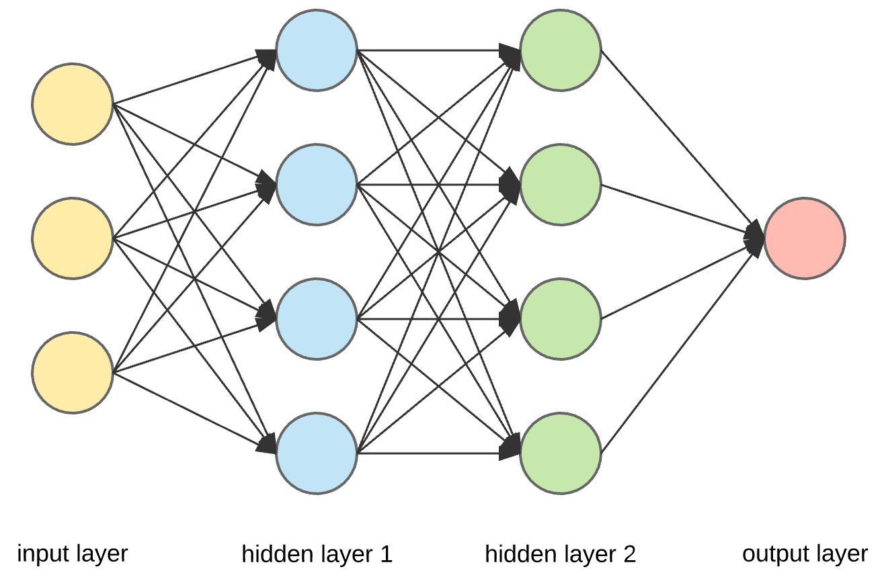{ width=50% }

Hvert lag har en række noder, også kaldet neuroner. Disse noder tager summen af det tidligere lags noders output, med en vægt på hvert input, og et bias. Denne sum bliver brugt i en activation funktion, som gør at de mulige resultater ikke er lineære. Resultatet af activation funktionen bliver nodens output.
Når det neurale netværk trænes, giver man den en række inputs og forventede outputs. Netværket beregner derefter det output den ville give, og en loss function bliver brugt til at beregne afvigelsen mellem det forventede output, og det aktuelle output.
En backpropagation metode bliver brugt til at finde ud af hvor meget en nodes vægte er med til at skabe afvigelsen, og dermed hvor meget vægtene skal ændres.

Et Recurring Neural Network (RNN) er et neuralt netværk, som bruger tidligere outputs fra det neurale netværk til at ændre det output den ville give. Det gør dermed at netværket bedre kan skabe en helhed i en serie af inputs som sker over tid.
Et problem med RNN’er er at de meget let kan lave fejl under træningen, hvis de bliver trænet på samme måde som et normalt neuralt netværk. Dette er fordi backpropagationen ikke er god til at ændre vægte, som er afhængige af et tidligere output, når der er mange outputs mellem noden og outputtet.
De mest normale måder at løse dette problem er ved at tilføje enten et Gated Recurring Unit (GRU), eller et Long Short Term Memory (LSTM). Et GRU opdaterer nodens forståelse af det tidlige output, ved først at lave en opdateret version af nodens forståelse af det tidligere output ved brug af en relevance gate som bestemmer hvor vigtigt outputtet er. Derefter bruger den en update gate, som bestemmer hvor meget af den gamle version som skal beholdes, og hvor meget der skal kasseres.
LSTM fungerer næsten på samme måde som GRU, men tilføjer en forget gate, som bruges til at finde ud af hvor meget af den tidligere nodes vægte der skal bruges. LSTM er generelt mere præcis end GRU, men kræver også mere computerkraft for at kunne trænes.

Et BRNN fungere ligesom et RNN, men i stedet for kun at have et enkelt system som tager outputs fra én retning, har BRNN to systemer som går i hver sin retning (dermed bidirectional). Nedenstående billede viser en illustration af et BRNN.

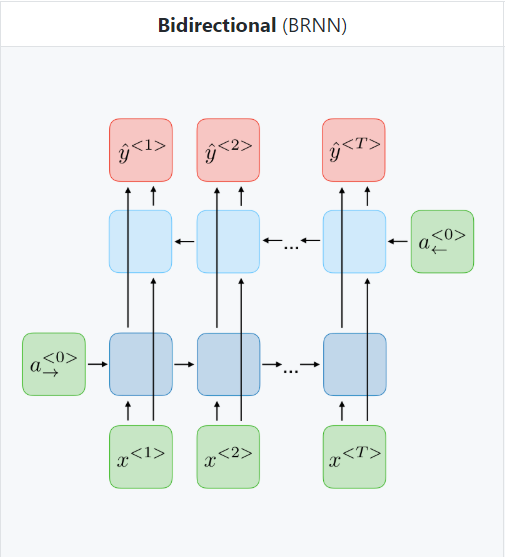{ width=50% }

Dette gør at et tidligere output kan ændre sig baseret på hvad der bliver gjort i nuet. De to retninger interagerer ikke med hinanden, så de kan derfor trænes separat på samme måde som et RNN.

Et problem med hensyn til at få et neuralt netværk til at forstå lyd og tekst, er at den kan tage flere inputs af den samme lyd, hvis man udstrækker den. Dette kan gøre det meget tidskrævende at træne det neurale netværk, da det skal overveje mere. CTC løser dette problem ved at prøve alle de forskellige muligheder givet, og tager den som der er størst sandsynlighed for er rigtig. CTC ser ingen forskel mellem en eller flere af det samme output, så sandsynlighederne for mængden af outputs der er ens, ganges sammen. Hvis der skal være flere af det samme output lige efter hinanden, kræver det et blankt output, som sættes imellem dem, og som bliver fjernet når outputtet vises.
For at træne et neuralt netværk som bruger CTC, skal den udregne hvad chancen er for alle de mulige kombinationer som giver det samme svar. Det vil sige alle serier af det samme output, og serier af det samme output med blanke outputs foran og bag sig. Alle chancerne for de forskellige output lægges sammen. Loss funktionen svarer til den negative logaritme af chancen, og bruges til at træne netværket på samme måde som et normalt neuralt netværk.

For at kunne bruge SpeechRecognition, kræver det at det man har sagt bliver gemt i cache. Da den information som bliver gemt ikke kan bruges til at identificere en person, og bliver fjernet så snart at en ny person bruger produktet, klassificeres det ikke som personlig data, og overtræder derfor ikke EU’s General Data Protection Regulation (GDPR), som er en nyere persondatalov der blev indført i april 2018.

## Webudvikling

### HTML

HTML står for HyperText Markup Language. HTML er et programmeringssprog som benyttes i forbindelse med udviklingen af en hjemmeside. HTML har været under udvikling stort set siden internettets begyndelse, og HTML bliver stadig udviklet og designet af The World Wide Web Consortium.
Opbygningen af et HTML dokument deles op i to blokke; head og body. I head blokken skrives alt metadata der omhandler hjemmesiden. Dette er fx. titlen på hjemmesiden som den vises i toppen af browservinduet, og evt. et link til et logo der skal vises ved siden af titlen i browservinduet.
I body blokken skrives alt det der skal vises på selve hjemmesiden. Dette kan fx. være overskrifter og normal skrift.
HTML fungerer ved hjælp af såkaldte tags som giver en browser instruktioner omkring hvad der skal vises på skærmen. Ønsker man at skrive tekst i fed skrift på sin hjemmeside kan man bruge et b-tag som skrives således: ``<b></b>``. Den tekst man ønsker at gøre fed skal stå i midten af b-tagget. Vil man fx. skrive ‘Hello World’ i fed skrift, ville man skrive det således: ``<b>Hello World</b>``. Der findes mange forskellige tags der gør mange vidt forskellige ting; men når man som udvikler i HTML først har lært at bruge disse tags, er HTML relativt nemt at kode i. Er man blot en amatør inden for programmering i HTML, og ønsker at prøve sine kræfter af med at lave en simpel hjemmeside, er svaret til de spørgsmål man måtte have som oftest blot en Google søgning væk. Internettet er fyldt med folk der til dagligt programmerer i HTML, og mange af dem vil hellere end gerne hjælpe nybegyndere med at lære programmeringssproget. HTML bruges dog kun til at kode de mest basale ting på en hjemmeside, så som overskrifter og fed tekst. Hvis man ønsker et lidt mere moderne design på sin hjemmeside, kan man gøre brug af CSS.

### CSS

CSS står for Cascading Style Sheet. CSS er i dag standardmetoden der bruges til at ændre farver og skrifttyper på elementer på en hjemmeside. Man kan enten vælge at bruge ét stylesheet til hele sin hjemmeside, eller lave flere forskellige stylesheets til undersider på ens hjemmeside.
CSS fungerer ved at man koder såkaldte regler for hvordan elementerne på ens hjemmeside skal se ud. Hver regel skal som minimum bestå af en selector og én declaration; det er dog muligt at benytte flere declarations i én regel. Selectoren beskriver det element som der skal ændres, og declarationen beskriver ændringen. Hver declaration skal indeholde en property og en value - hvor property beskriver den ting der skal ændres, og value beskriver det som tingen skal ændres til. Property og value separeres med et kolon.
Billedet herunder beskriver visuelt hvordan en CSS regel skal sættes op:

{ width=50% }

Hvis en regel indeholder mere end én declaration, skal disse adskildes med semikoloner.
Der er mange fordele ved at benytte CSS til at designe sin hjemmeside:

* Hjemmesider med CSS indlæser op til 50% hurtigere end andre hjemmesider
* Mindre kildekode er nødvendigt når man benytter CSS
* Designet på alle hjemmesidens undersider holdes ensartet når de benytter det samme stylesheet
* Det tager blot et par linjer kode at ændre designet på hjemmesiden
* Da CSS er standardiseret, er alle browsere i stand til at vise hjemmesiden

Det er i disse dage vigtigt at have kendskab til CSS når man skal udvikle en hjemmeside, eftersom det er den hurtigste og mest effektive måde at designe en hjemmeside på. Hjemmesider der ikke gør brug af CSS indlæser ofte langsomt og ligner mest af alt noget der blev designet i internettets tidlige dage.

#### Materialize CSS

Materialize CSS er et framework lavet af et hold fra Carnegie Mellon University i 2014. Det giver en lettere måde at få ens hjemmeside til at se godt ud, ved at følge material design, som er et designsprog lavet af Google, med formålet at samle klassiske design principper med nyt teknologi. Formålet med Material Design er tre forskellige ting:

* At få ting til at ligne noget fra den virkelige verden
* At skabe et fokus og hierarki
* At give ting en bevægelighed så det virker mere ægte.

Materialize CSS gør det lettere at implementere disse principper, da man blot skal give et element en bestemt klasse, og så gør Materialize CSS resten.

### JavaScript

JavaScript (JS) er et programmeringssprog udviklet af Brendan Eich. JS anvendes primært til scripts på websider. Det kan dog også bruges uden for internetbrowseren, som fx i Electron-frameworket og Node.js. JavaScript kompilerer koden ved run-time, altså undervejs, og skal ikke kompilerer hele kildekoden før brug. JavaScript bliver eksekveret på klient-siden, hvilket vil sige i browseren, og det er derfor oplagt at bruge til designet eller funktionaliteten af dynamiske og interaktive elementer på en hjemmeside. JavaScript er sammen med HTML og CSS de grundlæggende byggesten til webdesign på klient-siden.
JavaScript har nogle regler for hvordan et JavaScript program skal sættes op. En variabel i JavaScript er lavet ved først at sætte “var” foran. Dette skal gøres før man kan bruge variablen i sit program. Variablen bliver givet en værdi ved at sætte et lig med tegn efter variablen.
Nøgleord bruges til at fortælle JavaScript at den skal lave nogle specielle handlinger. Grunden til at “var” skal bruges er fordi “var” er et nøgleord, som fortæller JavaScript at det skal lave en variable.
For at kommentere i JavaScript skal man sætte to skråstreger før den sætning som er en kommentar. Dette gør at JavaScript ignorerer den linje, og kører derfor ikke linjen som kode. Dette kan også bruges til at “udkommentere” en linje kode som man ikke vil fjerne, men som ikke skal bruges på det pågældende tidspunkt.
En funktion i JavaScript er nogle linjer kode som kun bliver aktiveret når funktionen bliver kaldt. For at lave en funktion bruger man nøgleordet “function” efterfulgt af det navn man giver funktionen, og parenteser til sidst. Koden som skal aktiveres når funktionen bliver kaldet bliver placeret imellem nogle tuborgklammer ({}), lige efter at funktionen bliver lavet. Funktionen kan have parametre inde i parenteserne, som er variabler unikke til funktionen, som den bliver givet når man kalder den.
For at kalde en funktion, skriver man funktionens navn, efterfulgt at parenteser. Hvis funktionen har nogle parametre, skriver man dem inde i parenteserne.
Hvis en variable bliver lavet inde i en funktion, kan den kun bruges indenfor den funktions kode, hvorimod en variabel uden for en funktion kan bruges globalt.

Man bruger oftest JavaScript på en hjemmeside, når man skal bruge dynamiske elementer. Det kan altså både være visuelt dynamiske elementer, som animationer, eller funktionalitetsmæssigt dynamiske elementer. JavaScripts funktionalitet udvides ofte med libraries som jQuery, som gør det lettere at manipulere med HTML-elementer fra et script. jQuery kan både ændre HTML- og CSS-elementer i en HTML-fil og dette som regel i en linje kode.
JavaScript er en optimal løsning til vores produkt, da vi har brug for realtidsinteraktion mellem bruger og brugerflade. Der skal være adgang til en stor mængde information, men kun det efterspurgte skal vises. JavaScript kan sammen med jQuery bruges til at skabe denne dynamiske brugerflade ved at udskifte elementer efter behov. Al informationen er altså indlæst og klar til visning, men det vises kun, når brugeren vha. en kommando efterspørger noget specifikt information.

## Vivify Scrum

Vivify Scrum er et program på en hjemmeside som hjælper gruppemedlemmerne med at holde styr på det der skal laves i projektet. Vivify Scrum fungerer ved at man har en backlog med alle de issues sim der på et tidspunkt skal arbejdes på. En issue i backloggen kan flyttes til den såkaldte ‘Sprint’, hvor de issues der fokuseres på i øjeblikket befinder sig. En issue kan så igen flyttes til ‘I gang’, hvilket betyder at det pågældende issue er i gang med at blive løst. Når man har løst et issue, kan det flyttes til ‘Done’. Når et issue er i denne gruppe er det løst, og man kan gå videre til et andet issue.
Vivify Scrum giver også gruppemedlemmerne mulighed for at tildele opgaver til sig selv, eller til andre i gruppen. Dette gør at man hele tiden har styr på hvem der laver hvad, og er også med til at sikre at der hele tiden bliver arbejdet på projektet.
Vi har desuden tilføjet en gruppe til de problemer der opstår i vores arbejdsprocess. Vi kan derfor hele tiden observere om vi har nogle problemer med projektet, og aktivt arbejde på at løse disse problemer. Billedet nedenfor viser hvordan Vivify Scrum virker. På billedet nedenfor kan vores Backlog, Sprint, I gang, og Done grupper ses.

## Figma

Figma er et online tegneprogram som vi bruger til at lave vores kort. Selve programmet indeholder ikke en stor mængde features, men indeholder dog det vi skal bruge til at lave vores kort.
I starten havde vi planlagt at bruge programmer som Photoshop til at lave vores kort, men disse programmer er alt for avancerede, og derfor svære at bruge til at lave noget relativt simpelt som vores kort. Vi valgte derfor at bruge Figma til at lave vores kort.

## Adobe XD

Adobe XD er et designprogram som er udgivet af Adobe. Selve programmet fungerer stort set ligesom Figma, men er en del mere avanceret at bruge. Vi valgte at bruge Adobe XD til at lave vores designs til forsiden på vores produkt, idet vi følte at funktionaliteten i Figma ikke var tilstrækkelig til at skabe vores forside.
Adobe XD gjorde det også nemt at sammenligne designs, idet programmet understøtter arbejde på flere forskellige designs samtidigt. Vi endte dog ikke med at bruge de designs vi udarbejdede i Adobe XD, men de blev dog brugt som inspiration til vores endelige design af forsiden på vores produkt.

## Git

Git er et version control system (VCS) udgivet i 2005 af Linux Development Team. Systemet kan holde styr på ændrings-/rettelseshistorikken, og er designet til at kunne understøtte flere parallelle grene i et projektforløb, så man kan have en udviklingsproces der ikke er lineær. Ændringshistorikken i et projektforløb bliver dokumenteret med selve ændringen og en tilhørende kort, forklarende tekst om ændringen, således at man ikke mister tidligere versioner når man ændrer på en fil. VCS’er gør det også nemmere når flere personer ændrer i de samme filer, da man kan se på hvad der er blevet ændret, i tilfælde af at der er en fejl i form af forskellige versioner af den samme kode.
En stor forskel mellem Git og andre VCS’er er den måde den gemmer ændringerne i filerne. De fleste andre VCS’er gemmer filerne, og gemmer derefter ændringerne i filerne, hvorimod Git betragter alle ændringer i filerne som en ny version af filen. Dette er igen med til at forhindre at der opstår fejl når flere personer redigerer i den samme fil på samme tidspunkt.
En Git-arbejdsproces er delt op i forskellige stadier. Et projekt - altså en samling af filer - kaldes et repository, og man arbejder som udgangspunkt med et repository lokalt på sin computer. Dette betyder enten, at man initialiserer et repository fra sin maskine, eller at man kloner et eksisterende repository fra nettet. Der er dog andre muligheder, såsom kloning via en SSH-forbindelse, men det mest almindelige er at klone via en HTTPS-forbindelse (altså fra internettet). Når man har redigeret en eller flere filer, ‘committer’ man filerne til Git-indekset. Et ‘commit’ kan bestå af en eller flere filer, og de beskrives med en kort forklaring om ændringen. Når man er færdig med at redigere og committe filer, ‘pusher’ man filerne til ens repository. Filerne er nu blevet ændret, ændringshistorikken er blevet dokumenteret, og andre kan nu klone eller ‘pulle’ det opdaterede repository.

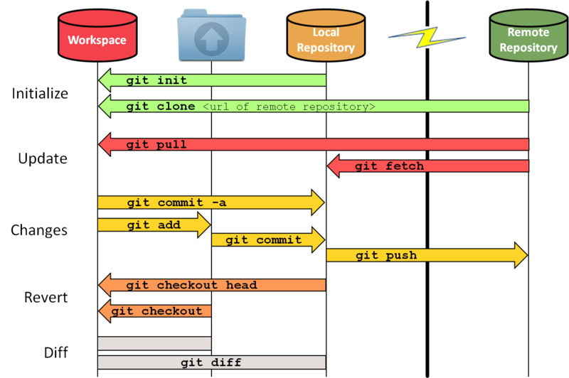{ width=50% }

Git-repositories kan hostes på nettet med en service som GitHub, GitLab, BitBucket eller Mercurial. Som standard deler disse services ens repository på deres hjemmeside, hvilket gør Git til et oplagt redskab for gratis open-source programmer, (programmer med offentlig kildekode). De fleste af disse services giver også mulighed for feedback på den aktuelle kildekode, kaldet issues. Alle og enhver kan åbne issues, og alle kan svare på et åbent issue. Kun ejeren af repositoriet kan markere dem som værende løst.

\newpage

## GitHub

GitHub er et online lagringssystem, som vi bruger til at opbevare de filer vi arbejder med. GitHub fungerer via Git-repositories, som man vha. Git VCS’et kan uploade filer til, og downloade filer fra. Til at uploade og downloade filer fra vores repository bruger vi både Git som terminal applikation, og GitHub Desktop, som er Git med en grafisk brugerflade.
Idet vi arbejder i grupper i dette eksamensprojekt, er det smart at alle har de filer der arbejdes på. GitHub gør os i stand til hele tiden at være opdaterede på det de forskellige gruppemedlemmer er i gang med at arbejde på, og gør os i stand til at arbejde videre på det en anden har arbejdet på.

### GitHub Pages

GitHub Pages er en udvidelse til GitHub der gør os i stand til at udgive vores projekt på nettet. Når GitHub Pages bliver aktiveret, leder den efter filen ‘index.html’ i rodmappen på projektet. Derefter kan projektet tilgås og køres ved at besøge en url frem for at køre projektet på sin egen computer. Dette er en stor fordel for os idet vi arbejder med en Raspberry Pi, som har en begrænset mængde af lagringsplads. En anden fordel er at vi ikke er nødt til at opdatere programmet, der køres på vores Raspberry Pi, idet det hele kører over en webserver. Dette er smart, hvis vi skal opdatere, tilføje eller fjerne funktioner undervejs.

# Anvendelse, Målgruppe og Mockup

## Målgruppe

Ofte sker det at man møder op på offentlig institution, (som eksempel et museum eller et bibliotek), hvor man ikke kan finde ud af hvor man skal hen for at finde det man søger. Der er derfor blevet sat infoskærme op, så man kan nemmere finde rundt.
Desværre er de fleste infoskærme alt for avancerede, eller fyldt med for mange menuer, som man ikke kan finde rundt i. Det ville derfor være nemmere hvis man bare kunne sige højt hvad man leder efter, og så ville infoskærmen vise vejen til stedet. Det er det koncept vi har valgt at bruge i vores projekt, hvor vi laver vores “user friendly” infoskærm, hvor det eneste man skal gøre er at sige hvor man skal hen, og så viser infoskærmen et kort over området, og viser en rutevejledning til det sted man søger.
Vi har dog valgt at indsnævre målgruppen til skolens elever og dens besøgende, så vi har et startpunkt for produktet. Ved at vi laver produktet til Slotshaven gymnasium, gør vi så man kan nemmere kan finde rundt på skolens grund, og finde de lokaler man søger.

## Anvendelse/use-case

Et eksempel på en anvendelse af skærmen er når en brobygger ved navn John skal på skolen sammen med sine venner. Problemet er at John mødte for sent, så han ved ikke hvor hans venner befinder sig. Han ved at de skal være i et lokale der hedder “Innolab 3” men han ved ikke hvor lokalet befinder sig på skolen.
John ser en skærm hvor der står at man kan spørge den om vej til skolens forskellige, så han går hen og trykker på mikrofonen og siger “Hvor er Innolab 3?”. Herefter viser skærmen et kort over skolen med en detaljeret rutevejledning til Innolab 3, samt nogle korte informationer omkring lokalet. John fulgte rutevejledningen til lokalet, og fandt lokalet. Han var nu i stand til at deltage i undervisningen sammen med sine venner. Hvis ikke han havde fundet lokalet, havde han ikke nået at være med til undervisningen, og ville i sidste ende ikke vælge at tage en HTX uddannelse på Slotshaven Gymnasium.

## Mockup

{ width=50% }

{ width=50% }

Som billederne ovenover viser, så vil skærmen vise en besked hvorpå der står “Hvor skal du hen? Sig f.eks “Hvor er rektors kontor”, og så vil jeg vise dig vej”. Når brugeren siger dette, vil skærmen vise vej til lokalet.
Tegningen er meget basal, idet der ikke vises en stor mængde visuelle effekter på skærmen, andet end en kort introduktionstekst til hvordan produktet bruges, og et kort der viser vej til et lokale når der bliver sagt en kommando.

# Kravspecifikation

Vi skal have en lydgenkendelse som kan forstå alle lokalerne. Dette indebærer at den skal kunne kende forskel på tal og ord. Den skal også være i stand til at kunne forstå hvad der bliver sagt, selvom der er baggrundsstøj i form af andre folk der taler og andet generel baggrundsstøj.
Den skal kunne fremvise forskellige kort, fra en stor database, alt efter hvad man siger.

|      **Krav**     |                                           **Beskrivelse**                                           |       **Testmetode**         |
|:-----------------:|:---------------------------------------------------------------------------------------------------:|:----------------------------:|
|    Bagrundsstøj   |          At systemet skal kunne høre personen der snakker, selv om der er støj i baggrunden         |        Programmatisk         |
|     Tydelighed    |           Systemet skal vise vej på en tydelig måde, og det skal kunne være til at forstå           |         Kvalitativ           |
|   Imødekommende   |                Man skal kunne se præcist hvad man skal gøre for at aktivere systemet                |         Kvalitativ           |
|     Aktivering    |                   Systemet skal kunne aktiveres ved at man siger en specifik frase                  |   Kvantitativ & Kvalitativ   |
|     Forståelse    |        Systemet skal være i stand til at opfange hvad der bliver sagt, og agere som den skal        |        Programmatisk         |
|      Samspil      |   Samspillet mellem teknologierne skal være hurtigt og effektivt så folk ved at den opfattede det   |        Programmatisk         |

\newpage

# Produktudformning

## Flowchart

Nedenstående billede viser et Flowchart der beskriver hvordan vores produkt skal fungere. De gule elementer beskriver de steder hvor der sker noget på selve infoskærmen, de blå elementer beskriver input fra brugeren af produktet, og de grønne elementer beskriver ting der sker i baggrunden af programmet (altså i selve koden).

Når Raspberry Pien er blevet sat op, og programmet er startet op, er produktet klar til brug. Når en person går op til skærmen og trykker på mikrofonknappen, begynder koden i script.js at optage personens stemme. Personen siger en kommando så som “Hvor er rektors kontor”, og optagelsen af denne kommando bliver sendt til WebSpeechAPI. WebSpeechAPI håndterer optagelsen, og transskriberer det der er blevet sagt til tekst. Denne tekst bliver derefter analyseret, og krydsrefereret med en database af ord. Databasen indeholder keywords så som “rektor”, som hjælper WebSpeechAPI med at identificere om der er blevet sagt en kommando, eller om der er blevet sagt noget som programmet ikke understøtter. Hvis WebSpeechAPI finder et ord som er blevet sagt som passer med et ord fra databasen, vil programmet vise det relevante indhold for den kommando der er blevet sagt. Samtidigt vil en timer på 30 sekunder begynde. Når de 30 sekunder er gået vil programmet vise startskærmen, og en ny bruger kan benytte produktet. Der kan dog stadig siges en ny kommando selvom at der allerede vises indhold på skærmen. Brugeren skal blot klikke på mikrofonknappen, og indtale en ny kommando.
Hvis WebSpeechAPI ikke finder et ord som passer med et ord fra databasen, vil programmet vise en tekst hvor der står “Jeg kunne desværre ikke forstå hvad du sagde. Prøv igen”. Denne tekst vil være på skærmen i 5 sekunder, hvilket giver brugeren tid til at læse hvad der står og forstå at han eller hun skal prøve at indtale sin kommando igen.

## Montering af produktet på infoskærmen

### Konstruktion i plastik

Vores oprindelige idé var at lave en holder til vores Raspberry Pi og tilhørende mikrofon i plastik ved brug af 3D-Print. Ideen var at holderen skulle skrues fast til bunden af infoskærmen med en skrue. Vi kom dog hurtigt i tvivl omkring om én skrue var tilstrækkelig til at fastgøre hele holderen og indholdet til bunden af infoskærmen. Vi kom dog til konklusion at én skrue var nok, idet den samlede konstruktion ikke vejede mere end én skrue kunne bære. Vi gik derfor i gang med at designe vores holder i Blender. Da vores design var færdigt, eksporterede vi det til et program kaldet Craftware, som konverterer designet til et format som 3D-Printeren kan forstå.
Vi satte derefter 3D-Printeren i gang med at printe vores design. Da det at 3D-Printe er en langvarig proces, var printet først færdigt dagen efter. Vi fandt dog ud af at 3D-Printeren ikke var kalibreret korrekt, hvilket forårsagede et fejlprint af vores design.
Vi sikrede os at der ikke var nogle problemer med designet, og gik i gang med vores andet forsøg på at 3D-Printe vores design. Vi oplevede dog at der skete den samme fejl med 3D-Printeren som i vores første forsøg, og vi droppede derfor ideen om at 3D-Printe vores holder. Billedet nedenfor viser det design, som vi udarbejdede i Blender:

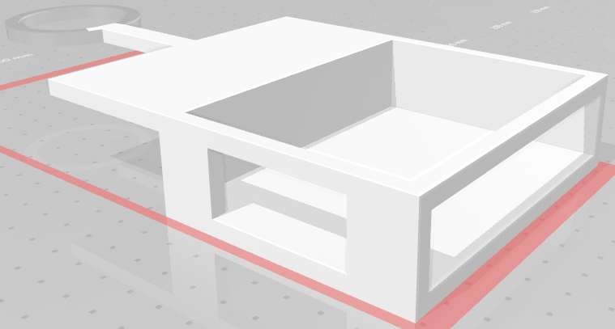

### Konstruktion i træ

Da vi ikke var i stand til at 3D-Printe vores holder, valgte vi i stedet at lave holderen ud af træ. Da vi tidligere havde arbejdet i træ i forbindelse med projekter i andre fag, kendte vi allerede til hvordan man arbejder i træ, og hvilke muligheder der findes i forbindelse med udarbejdelsen af en konstruktion i træ.
Vi valgte at lave selve holderen ud af en trækasse som vi fik udleveret af vores lærer. Vi havde tidligere arbejdet med en trækasse af samme model i et andet projekt, så vi vidste allerede hvor meget kassen kunne holde til, og hvilke typer træ som kassen var lavet af.
Kassen var delt op i to dele; siderne af kassen og låget på kassen. Siderne af kassen var bygget op af 3 lag krydsfiner, og låget på kassen bestod af ét lag krydsfiner.
Vi skar huller i kassens låg, så vores mikrofon og det tilhørende kabel kunne være i kassen. I siderne af kassen skar vi ligeledes huller, så de tilhørende kabler til vores Raspberry Pi kunne komme ind i kassen og tilslutte til Raspberry Pien.
Vi valgte også at skrue en skrue fast i bunden af kassen under det udskårne hul til mikrofonen, således at mikrofonen kunne skrues fast til kassen. Derved fastgøres mikrofonen til kassen, og har derfor ikke mulighed for at falde ud af kassen.
Udover selve kassen der skulle indeholde Raspberry Pien og mikrofonen, lavede vi også en konstruktion der skulle gøre kassen i stand til at blive monteret på infoskærmen. Denne konstruktion blev lavet ud af træ, som var bygget op af 5 lag krydsfiner. Vi valgte at bruge en tykkere type træ til denne konstruktion, idet den største mængde stress på konstruktionen ligger der hvor kassen bliver monteret til infoskærmen.
Trækassen måler 22 cm x 9 cm x 4 cm (L x B x H).
Billederne nedenfor viser vores konstruktion som vi udarbejdede i træ:

{ width=50% }\ { width=50% }

\newpage

## Kort til rutevejledning

I forbindelse med udviklingen af produktet blev lavet nogle kort som skulle indgå i produktet. Formålet med disse kort var at give en detaljeret rutevejledning fra brugerens lokation på skolen, til det lokale som personen søgte. Det var vigtigt at disse kort var så detaljeret som muligt, idet de skulle hjælpe brugeren med at finde det lokale de søgte.
Kortene taget udgangspunkt i det eksisterende kort over skolen, som er beskrevet i afsnittet Eksisterende løsninger.
Kortet viser en rød cirkel som beskriver hvor brugeren i øjeblikket befinder sig. Ud fra den røde prik går der en rød streg, som viser vej til det søgte lokale. For enden af den røde streg er det en pil, som viser hvor lokalet befinder sig.
Kortene tager udgangspunkt i at produktet køres på infoskærmen der befinder sig ved hovedindgangen. Grunden til at vi valgte at lave kortene med udgangspunkt i infoskærmen ved hovedindgangen var at der er det sted på skolen som flest folk passerer i løbet af en dag. Dette medfører at flere personer vil benytte vores produkt, end hvis vi havde opsat produktet et andet sted.
Et billede af et af kortene kan ses nedenfor:

{ width=50% }

\newpage

## Software-design

Gestaltlovene beskriver en række designmæssige standarder, som er baseret på menneskers naturlige evne til at afgrænse separate objekter, og opfatte deres helhed.
I forbindelse med vores produkt har vi benyttet MaterializeCSS, som fra starten overholder loven om lukkethed: “Elementer, der står i samme ramme, opfattes som hørende sammen.” Alle objekter i dette framework er omringet afrundede kanter og en skygge, hvilket fungerer som en ramme om elementet.

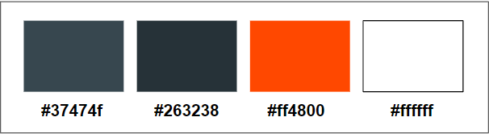

Derudover følger farverne et komplementært farveskema, som tager udgangspunkt i Slotshavens gennemgående orange farver og den komplemetære blå med formindsket saturation. Baggrundsfarven er orange, de to grå-blå farver bruges til kortene og knapperne, og teksten er hvid.
De interaktive knapper giver også visuel feedback ved brugerinteraktion. Når der trykkes på en knap, lyser den hvidt i et kort stykke tid, og når der optages pulserer knappen. Brugeren er altså ikke i tvivl om, hvor i processen man er.

\newpage

## Forside på produkt

I forbindelse med udviklingen af vores produkt skulle der udvikles en forside til produktet. Denne forside blev lavet i Adobe XD, hvilket er et designprogram udviklet af Adobe. Dette program er nærmere beskrevet under afsnittet Adobe XD.
Forsiden består af titlen på produktet (“Den Talende Infoskærm”), og en tekst der beskriver i korte træk hvordan produktet benyttes. Der er desuden et billede af en mikrofon på forsiden, som skal indikere at produktet fungerer ved hjælp af taleinput.
Designet blev udviklet i seks forskellige farvetemaer, således at vi som gruppe kunne vælge det farvetema som så bedst ud, og som vi følte ville passe bedst til produktet.
Vi valgte i sidste ende at gå med et orange og sort farvetema, idet det minder om det farvetema som Slotshaven Gymnasium gør brug af. Idet produktet skal opstilles og benyttes på Slotshaven Gymnasium, følte vi at det ville være en god ide at bruge det samme farvetema som skolen, så produktet så mere officielt ud, og lignede at det var udviklet og opsat af Slotshaven Gymnasium. De yderligere fem designs som vi udviklede kan findes i afsnittet Bilag.
Dette design endte dog med blot at være et udkast til den rigtige forside, idet vi endte med at designe forsiden i HTML ved hjælp af Materialize CSS.
Et billede af udkastet til forsiden i orange og sort farvetema kan ses nedenfor:

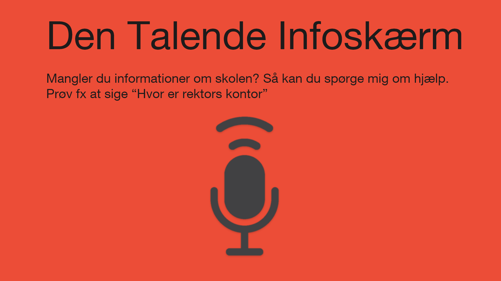

\newpage

## Test

I forbindelse med udviklingen af vores produkt har vi valgt at foretage en test af forskellige mock-ups af brugerflader, samt hvad der ville foretrækkes i en brugerflade. Dette blev gjort ved at interviewe to elever fra skolen. Vi viste dem tre forskellige eksempler på en startskærm, samt tre forskellige eksempler på hvordan et lokale kunne blive vist frem. Formålet med denne test var at gøre vores produkt intuitivt at bruge, samt gøre det imødekommende for brugerne af produktet.

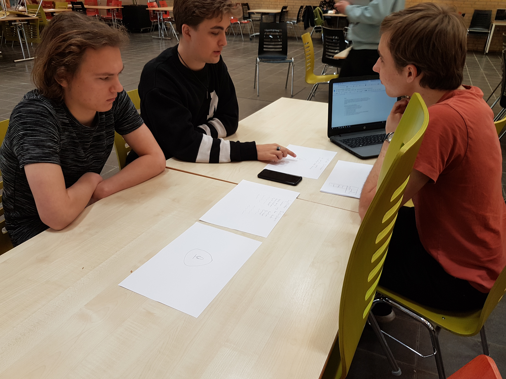{ width=50% }

Nedenfor er de punkter vi ville igennem i forbindelse med vores test:

* Hvad skulle startskærmen vise?
* Hvordan skulle startskærmen se ud for at folk kunne se hvad man kunne?
* Hvilken information ville være relevant at vise på startskærmen?
* Hvordan skulle stemmegenkendelses systemet starte.
* Hvordan skal lokalerne vises?
* Hvilken information skal der være om lokalerne?
* Hvordan skal informationen vises?

Et af ønskerne var at der blev vist hvilken klasse og hvilken lærer som var i et lokale, samt at man kunne sige en lærers navn, og få vist det lokale som læreren burde befinde sig i på det pågældende tidspunkt. Dette skulle gøres bl.a. så brobyggere kunne se om de var det rigtige sted. Da Lectios API ikke er offentligt tilgængeligt, vil den eneste måde at opdatere efter skolens behov være, hvis dette blev gjort manuelt.
Vores testpersoner var imod ideén om ikke at have tekst på startskærmen. En af dem mente at dette ville kunne misforstås som at den konstant optog ens stemme.
De foreslog at der var et visuelt respons, som viste at deres stemme blev opfanget og optaget. Som et eksempel på et respons nævnte de bølgerne som findes på den virtuelle assistent Siri lavet af Apple. Dette kan ses på billedet nedenfor:

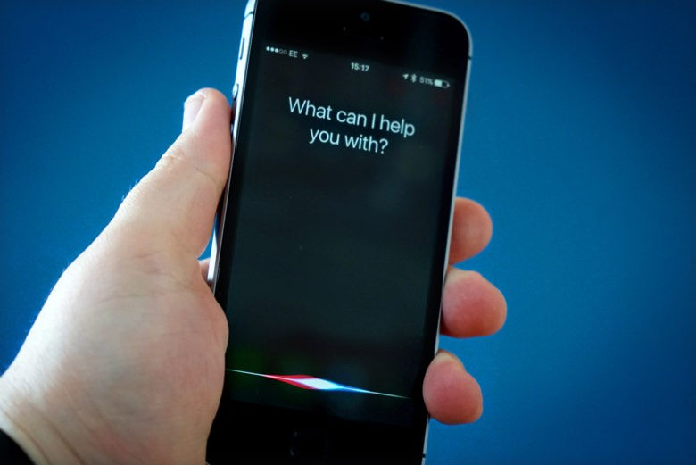{ width=50% }

De mente at det ville være for meget at have en liste over alle de kommandoer som skærmen kunne opfatte. De foreslog at have et eksempel som skifter efter et bestemt interval. På den måde kan man se forskellige eksempler på kommandoer, uden at skærmen blive fyldt med tekst.
Begge elever der blev interviewet kunne lide ideen om at der var en knap, som man trykkede på for at stemmegenkendelsen startede, men var uenige om hvorvidt det var nødvendigt at have tekst som siger at man skal trykke på knappen, eller om en knap er intuitiv nok i sig selv.
De ønskede begge tekst sammen med kortet, som kunne forklare noget praktisk viden om lokalet. Ud af de valg vi gav kunne eleverne bedst lide at have kortet til venstre, og teksten til højre, da de ikke ville læse teksten før de så på kortet. De foreslog også at versionen uden tekst kunne fungere hvis informationen poppede op når man trykkede på et lokale.
Eleverne ville gerne have punktopstilling til kortet, som viser brugbart information fx. de lokaler som man ville passere på vejen derhen.
De var imod brødtekst, da de mente at det ville gøre det sværere at finde relevant information. Med rektors kontor som et eksempel sagde eleverne at hvis der ikke er nok information der kan skrives i punktopstilling, ville det give mening at have noget brødtekst til at uddybe informationen omkring lokalerne.

\newpage

# Produkt

Vores endelige produkt kan sættes op ved en af infoskærmene på skolen, hvor den kan vise vej til det lokale som man siger til den. Den kan også give noget generelt information om det lokale man søger.

## Brugerfladen

Vores startskærm viser navnet på skolen, giver eksempel på hvordan man bruger skærmen, og har en knap med et billede af en mikrofon, som man skal trykke på for at SpeechRecognition begynder.

Når man trykker på knappen kommer der en bølgende effekt igennem knappen, som visualiserer at infoskærmen ved at man har trykket på den. Mens infoskærmen lytter til hvad man siger, vil der være en bølgende effekt som kommer ud af knappen. Denne effekt er der for at indikere at infoskærmen lytter efter en stemme, og gør også at man kan se når den stopper med at lytte efter en stemme. Størrelsen på knappen blev dikteret af, at en større knap ville få bølgen gennem knappen når man trykker til at lagge.

Hvis infoskærmen hører et ord som den forstår, vil den vise et kort frem med den relevante information omkring lokalet. Her er der også en knap til at få skærmen til at lytte efter en ny kommando. Knappen fungerer på samme måde som den tidligere knap, og har også samme effekter. Den er der i tilfælde af at infoskærmen hører den forkerte kommando, eller at der er en ny person som gerne vil bruge infoskærmen lige efter den tidligere bruger.

Efter omkring 30 sekunder går skærmen tilbage til den normale startskærm.
Hvis man siger noget som ikke er registreret i databasen som en kommando, eller hvis infoskærmen ikke kunne forstå hvad man sagde, vil der komme en linje op hvor der står: “Jeg kunne desværre ikke forstå hvad du sagde. Prøv igen.”. Denne linje forsvinder igen efter omkring 5 sekunder.
Skærmen har en lys, orange baggrund, med en mørkeblå farve for kortet og knappen. Det er farver som er på hver sin side af farvehjulet, og giver derfor en stor kontrast. Det er også en varm og en kold farve, så der forekommer en varme/kulde kontrast.

Vores endelige brugerflade er meget lig vores mockup, i forhold til den information som brugeren får.

{ width=50% }

En stor forskel er at vores mockup prøvede at give fornemmelsen af, at det er en person man snakker med, når man benytter vores produkt. Dette var en inspiration fra stemmegenkendelses systemer såsom Siri og Alexa. Vi endte dog med at ændre teksten til noget mere neutralt, da vi ikke mente at vores produkt var komplekst nok til at give illusionen af en personlighed.
Forskellen mellem vores endelige brugerflade og vores udkast er ikke særlig stor. Vi har gjort mikrofonen hvid, og lavet det om til en knap og omskrevet hvad der stod. Desuden har vi gjort skriftens farve til hvid, og gjort den orange baggrund lysere. Vi har også ændret på tekstens størrelse, så den bedre kan læses af brugeren.

\newpage

## Holder

Holderen til vores produkt er lavet ud af træ, og består af en trækasse og en konstruktion til montering af trækassen til infoskærmen. Holderen blev konstrueret i træ som en konsekvens af fejlede forsøg på at 3D-Printe en holder til vores produkt. Trækassen indeholder vores Raspberry Pi, vores mikrofon, og de tilhørende kabler til vores hardware. Der er skåret huller i trækassen, således at kablerne kan komme ind i kassen, og blive tilkoblet til de respektive indgange på Raspberry Pien og mikrofonen. I bunden af trækassen, under det udskårne hul til mikrofonen, befinder der sig en skrue. Dette giver os muligheden for at skrue mikrofonen fast til trækassen, således at den ikke falder ud af kassen. Da det udskårne hul til mikrofonen er en smule mindre end den bredeste del af mikrofonen, holdes låget på trækassen samtidigt fast til selve kassen af mikrofonen. Et billede af trækassen, og den tilhørende konstruktion i træ til montering af trækassen til infoskærmen, kan ses nedenfor:

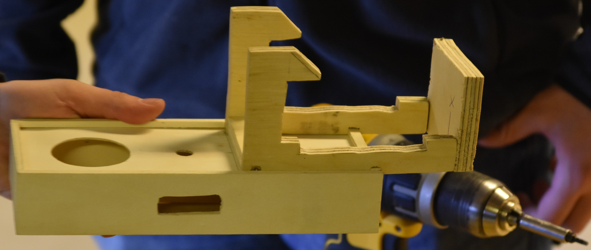

Holderen til vores produkt er designet således at det kun er mikrofonen som er synlig for brugeren. Grunden til at vi valgte at designe holderen til vores produkt således, var at vi ikke ville fylde området omkring infoskærmen med for mange ekstra ting, idet vores produkt skulle skabe illusionen om at man snakkede til selve infoskærmen, og ikke til en boks som var monteret ved siden af infoskærmen. Når holderen med Raspberry Pien og mikrofonen er sat op, kan man stadig se en lille del af trækassen, men man kan stadig se langt mindre af trækassen end hvis vi fx. monterede trækassen på væggen ved siden af infoskærmen. Det ville dog være mest optimalt hvis det kun var mikrofonen der var synlig når produktet var monteret på infoskærmen, men det nåede vi desværre ikke at finde en metode til at designe og udføre.

\newpage

# Konklusion

Vi har i gruppen formået at lave et intelligent system der viser folk rundt på offentlige steder, ved brug af stemmegenkendelse. Vi formåede også at lave vores produkt, så det fungerer som et plugin til de eksisterende infoskærmen der i forvejen findes på Slotshaven Gymnasium.
Dette formåede vi ved at kombinere funktionalitet fra HTML og Javascript til et samlet program, som kører på en Raspberry Pi ved hjælp af GitHub Pages. Raspberry Pi’en bliver tilsluttet til infoskærmen ved hjælp af et HDMI kabel, og touch-funktionaliteten der findes på infoskærmen bliver benyttet af Raspberry Pi’en ved hjælp af et "USB-A han til USB-B han"-kabel, som i daglig tale også bliver kaldt et printerkabel. Idet vores produkt kører online på GitHub Pages, er det nødvendigt at Raspberry Pi’en er tilsluttet til internettet. Dette bliver derfor gjort ved at tilslutte et netværkskabel til Raspberry Pi’en.
Når Raspberry Pi’en skal sættes op, er et tastatur input nødvendigt. Dette kræver derfor at man tilslutter et tastatur til en USB-indgang på Raspberry Pi’en. Man kan dog, når Raspberry Pi’en og programmet er sat op, fjerne tastaturet fra USB-indgangen, da programmet fungerer ved hjælp af touch-input, frem for tastatur input.
Da vores produkt kører på en Raspberry Pi, og bruger en ekstern mikrofon, var det nødvendigt at udvikle en holder som skulle indeholde det nødvendige hardware. Denne holder blev lavet ud af træ, og der blev samtidigt udarbejdet en konstruktion i træ, som skulle bruges til at montere holderen til infoskærmen. Der kan læses mere omkring holderen, og den tilhørende trækonstruktion til montering af holderen, under afsnittet Konstruktion i træ.
Produktet er blevet testet, og levede op til de krav vi havde stillet. Produktet var i stand til at give en detaljeret rutevejledning og informationer omkring lokaler som folk søgte, og fungerede selv om der var baggrundsstøj.

\newpage

# Bilag

## Tidsplan

**21/03**	\- Problem Undersøgelse

**28/03**	\- Undersøge hardware

**02/04**	\- Indsamling af hardware

**04/04**	\- Lav stemmegenkendelse

**18/04**	\- Skab kommunikation mellem stemmegenkendelse og infoskærm

**25/04**	\- Designe infoskærmens struktur

**30/04**	\- Implementering

**02/05**	\- Test

**07/05**	\- Rapportskrivning

**12/05**	\- Finpudsning af rapport

## Manual til Den Talende Infoskærm

### Opsætning

For at sætte Raspberry Pien op skal du bruge følgende:

- Et HDMI-kabel
- Et LAN-kabel
- Et tastatur
- En mus
- En touchskærm
- Et "USB-A han til USB-B han"-kabel (printerkabel)

Følgende instruktioner beskriver hvordan Raspberry Pien startes op:

1. Indsæt LAN-kabel i Raspberry Pi
2. Tilslut skærm og Raspberry Pi med HDMI-kabel
3. Tilslut skærm og Raspberry Pi med USB-kabel
4. Tilslut mus og tastatur
5. Indsæt strømkabel
6. Når login-skærmen vises indtastes brugernavn **pi** og adgangskode **rasp314**
7. Tryk <kbd>CTRL</kbd> + <kbd>R</kbd> for at genindlæse siden

\newpage

#### Sluk Raspberry Pien

1. Tilslut mus og tastatur
2. Tryk <kbd>ALT</kbd> + <kbd>F4</kbd>
3. Tryk på sluk-ikonet oppe i højre hjørne
4. Tryk "Luk ned"

### Brug af programmet

Programmet bruges vha. touch- og stemmeinput. Efter at have trykket på mikrofon-ikonet kan man spørge om vej til skolens lokaler. Information om og rutevejledning til lokalet vises derefter i 30 sekunder.

Man kan spørge efter følgende lokaler:

**Faglokaler**

- VR-lab
- Innolab
- Proces
- Teori
- Biokemi
- Fysik
- Teknologi
- Byg
- Musik

**Klasselokaler**

- Lokale 11-18
- Lokale 21-25
- Lokale 31 & 32
- Lokale 43-45
- Lokale 46-50
- Lokale 51-54
- Lokale 60-63

**Andre lokaler**

- Rektors kontor
- Studieadministrationen
- Studievejleders kontor
- Biblioteket
- Nordsalene
- Kantinen
- Printere
- 3D-printere
- Toiletter

\newpage

## Udkast til design af forside

### Design med blåt og orange farvetema

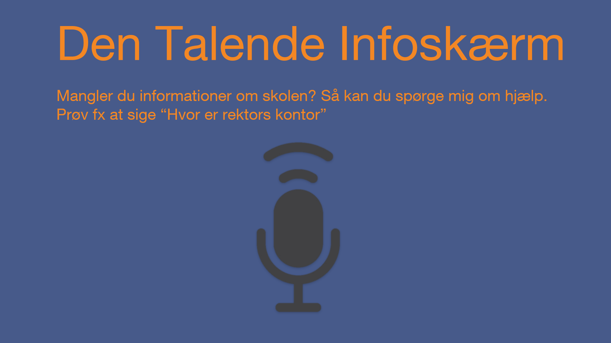

\newpage

### Design med lilla og gult farvetema

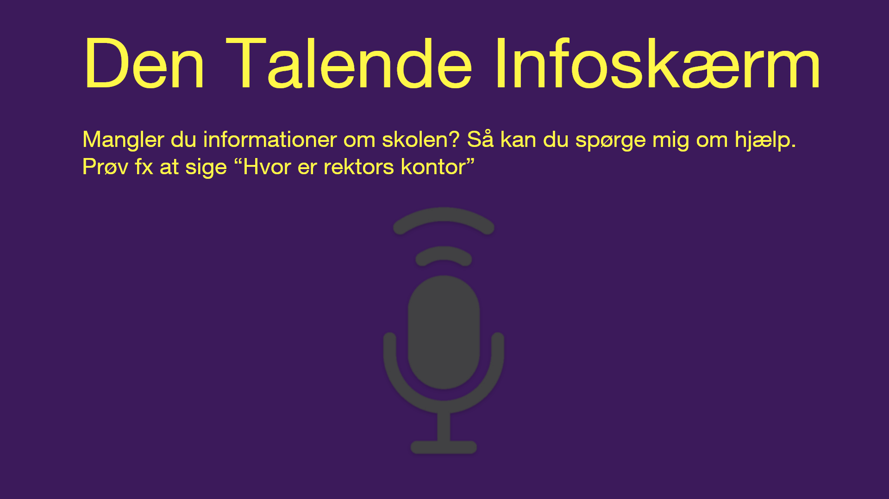

\newpage

### Design med blåt og lyseblåt farvetema

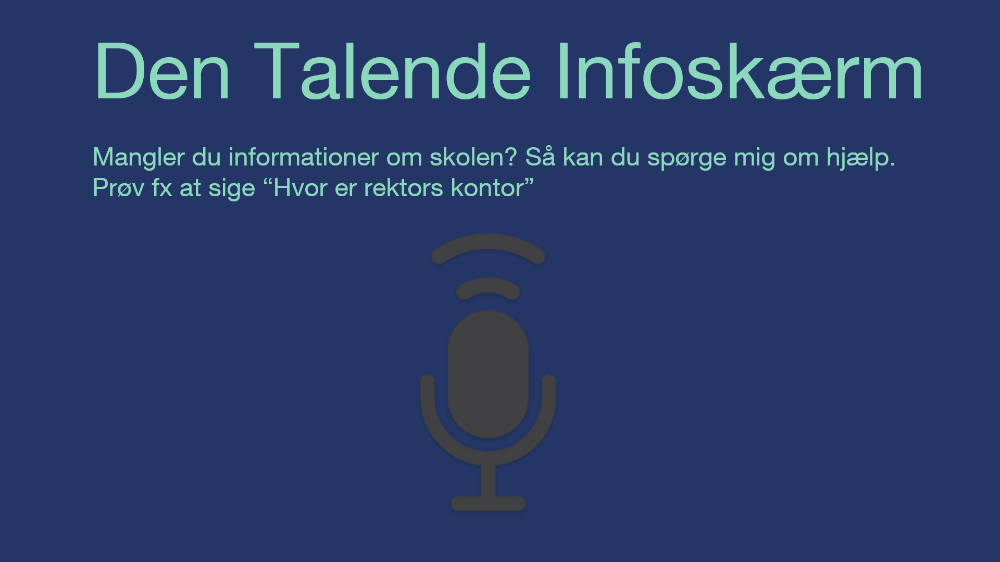

\newpage

### Design med lyseblåt og hvidt farvetema

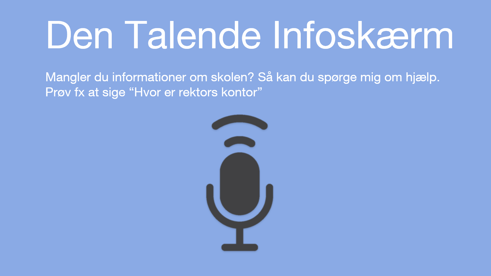

\newpage

### Design med gult og rødt farvetema

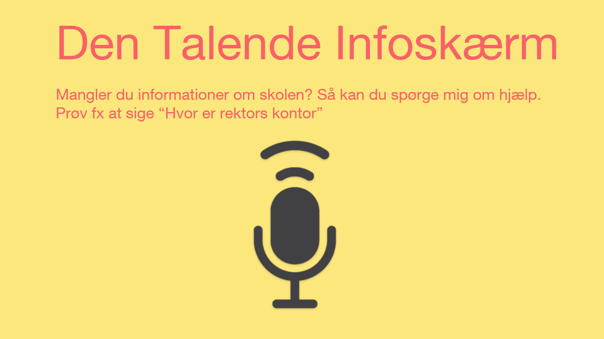

\newpage

# Litteraturliste
