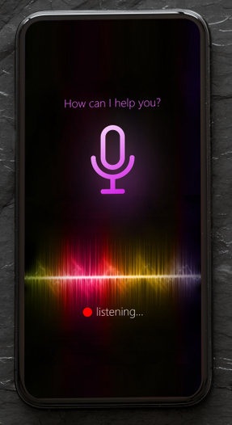
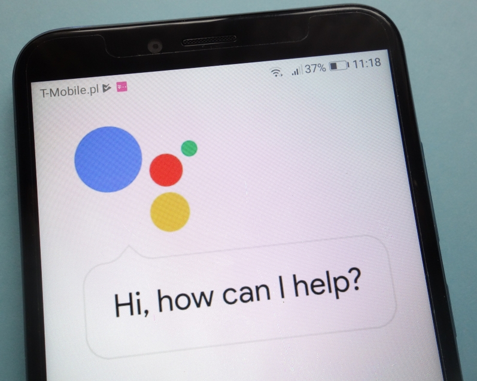
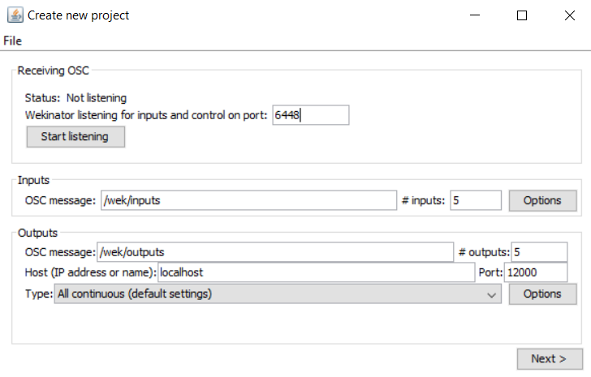
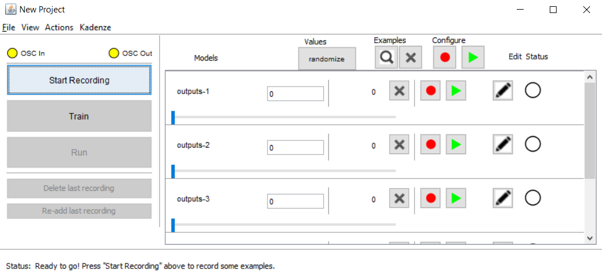
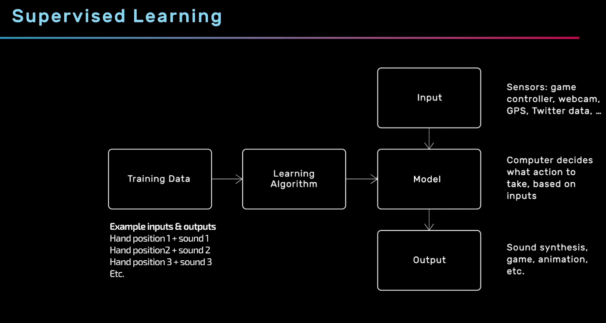
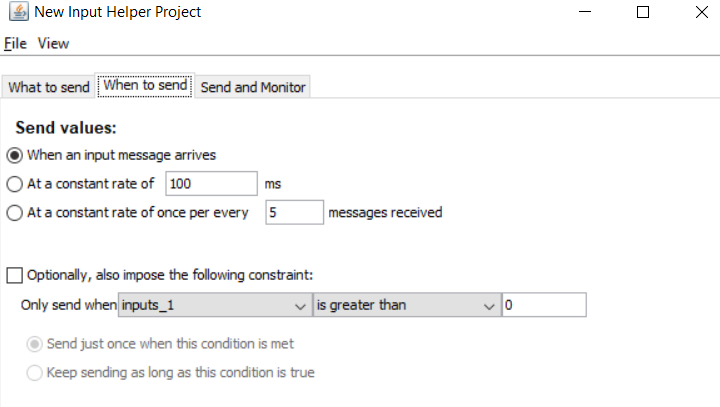
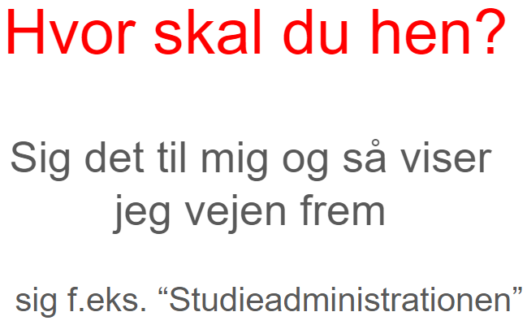
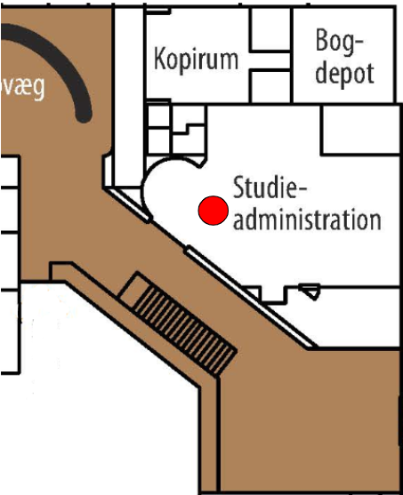

---
title: Den Talende Infoskærm
author: Bjarke, Jasper, Julius Westmann & Noah
date: 13-05-2019
titlepage: true
toc: true
toc-title: Indholdsfortegnelse
lang: da
csl: apa.csl
bibliography: digitek.bib
nocite: |
    @*
...

\newpage

# Produktkoncept

## Problemformulering

Hvordan kan man lave et intelligent system som viser folk hvor de skal hen på
offentlige steder ved brug af stemmegenkendelse?

### Underspørgsmål:

\- kan man lave systemet, så det kan fungerer som et plugin til eksisterende
infoskærme?

## Projektidé

Vores projekt består af en infoskærm som ved hjælp af stemmegenkendelse kan
vise gæster vej til et lokale når man spørger. For eksempel kan man på en skole
sige “rektors lokale” og så får man et kort der viser hen til rektors lokale.
Produktet henvender sig altså generelt til publikum på offentlige steder hvor
der i forvejen findes en digital infoskærm, specifikt til de besøgende der ikke
kender skolen indvendigt. Primært til 1.g’er, idet de ikke kender skolen lige
så godt som en 2.g’er eller en 3.g’er gør.

## Tematik

Titel: Den Talende Infoskærm \ Slogan: “Find din vej” \ Tematik: Talende/hjælpe
teknologi.

### Stemmegenkendelse

Stemmegenkendelse er en maskines evne til at modtage og forstå diktering i form
af talte kommandoer. Selve konceptet og teknologien der bruges i forbindelse
med stemmegenkendelse har faktisk eksisteret i over fem årtier, men er først
for nyligt begyndt at blive benyttet af den private forbruger. (Rouse, 2018)
Allerede i år 1976 var computere i stand til at forstå lidt over 1.000 ord, og
i løbet af 1980’erne var dette antal steget til omkring 20.000 ord. Dog skulle
der gå indtil år 1990 før privatpersoner fik adgang til at bruge teknologien.
Det var nemlig i dette år at firmaet Dragon udviklede og solgte det første
produkt der var i stand til at genkende og reagere på talte kommandoer.
Produktet blev kaldt ‘DragonDictate’, og det var en revolution indenfor hvad
computere var i stand til. Seks år senere udgav ‘IBM’ deres
stemmegenkendelses-produkt, som var i stand til at modtage og forstå en hel
sætning.  Siden 1990’erne er stemmegenkendelse blevet udviklet meget, og i dag
kommer de fleste smartphones med indbygget stemmegenkendelse. To eksempler som
stort set alle kender er ‘Siri’, som er udviklet af Apple, og ‘Google
Assistant’, som er udviklet af Google. Billedet herunder til venstre viser
‘Siri’, og billedet herunder til højre viser ‘Google Assistant’.

{ width=30% }\ { width=70% }

En anden populær device som understøtter stemmegenkendelse er ‘Amazon Echo’ som
er udviklet af Amazon. Denne device er beregnet til at blive brugt i private
hjem, og i starten af 2019 udsendte Amazon et indlæg til pressen om at de nu
havde solgt over 100 millioner devices. (Matney, 2019) Når en computer skal
foretage stemmegenkendelse sker der tre ting; først bliver det analoge signal i
form at den menneskelige stemme omdannet til et digitalt signal som computeren
kan forstå. Derefter bliver det digitale signal sendt gennem en form for
database, som indeholder en stor mængde af ord. Hvis computeren er i stand til
at matche det input den har fået med et ord i databasen, så vil dette ord blive
sendt videre til det program som har efterspurgt et input i form at tale. En
visuel repræsentation af processen der foregår når en computer skal forsøge at
tolke hvad der bliver sagt kan ses på billedet nedenfor.

Der er både mange fordele og ulemper ved brugen af stemmegenkendelse.
Teknologien gør bl.a. private forbrugere i stand til at bruge deres stemme til
at kontrollere mange forskellige smart-devices. Teknologien kan også blive
brugt til at konvertere tale til tekst. Der er dog også nogle ulemper ved
stemmegenkendelse; på nuværende tidspunkt er teknologien stadig “relativt” ny,
og derfor ikke perfekt. Dette gør, at hvis man forsøger at bruge
stemmegenkendelse når der er baggrundsstøj, så er det ikke altid at computeren
kan opfange hvad man siger. Stemmegenkendelse virker altså bedst i er stille
rum uden baggrundsstøj, hvilket begrænser brugen af stemmegenkendelse en smule.
Teknologien er også stadig så ny, at der nogle gange opstår problemer med ord
der lyder ens. Dette kunne være ord såsom “hear” og “here”. Her er computeren
ikke altid sikker på hvilket ord der er blevet sagt, og derfor kan en sætning
blive opfattet forkert når den bliver sendt videre til programmet som har
efterspurgt input i form af tale. Det er dog sandsynligt at disse “små”
problemer vil blive løst med tiden, efterhånden som stemmegenkendelse bliver
mere udviklet. Vi kan altså forvente en forbedring i teknologien i fremtiden,
og sandsynligvis en udryddelse af de småproblemer som teknologien har på
nuværende tidspunkt.  I vores projekt skal vi bruge stemmegenkendelse som
input, idet vores produkt skal fungere som en device man kan stille spørgsmål
omkring skolen. Vi skal altså have fundet den bedste måde at opfange og
analysere tale, og den bedste måde at implementere en database med svar til de
spørgsmål som vores device bliver stillet.

## Tekniske udfordringer

- At lave et digitalt system, der er i stand til at opfange analog lyd og
omforme det til til en output som systemet kan forstå (i form af ord eller
sætninger).
- At skabe mening ud fra det:
  - At kende forskel på tal og ord.
  - At fortolke korte sætninger semantisk.
  - At kunne ignorere baggrundsstøj og snak.
- At bruge talegenkendelsen til at vise relevante information infoskærmen.
- Infoskærmen skal kunne aktiveres ved, at brugeren siger en specifik frase.
- At bruge en Raspberry Pi til at køre systemet og lyd inputtet, da den er
lille og nemmere at programmere til det vi vil have, end en Arduino. Den har
også en HDMI indgang, hvilket kan bruges til at koble den til
infoskærmen/skærmen.

## Teknologier

Til at lave vores projekt skal vi bruge disse følgende ting:

### Raspberry Pi

Vi ville bruge en Raspberry Pi i stedet for at have en computer kørende ved
siden af infoskærmen.  En Raspberry pi er en lille computer først lavet i 2012
af velgørenheden fra UK ‘The Raspberry Pi Foundation’ for at give flere
personer muligheden for at kunne lære at programmere. Brugen af Raspberry Pi
har dog overskredet den oprindelige målgruppe, og bliver idag brugt til mange
forskellige formål.  Raspberry pi's er både små og relativt billige, for hvad
de kan gøre, så de kan efterlades uden frygt for et stort tab. Dette er godt
for offentlige institutioner da de let kan sættes ind i eksisterende teknologi,
og hvis en person af mere tvivlsom karakter vælger at røve eller forårsage
hærværk, bliver det ikke lige så stort et tab som hvis der var en rigtig
computer kørende ved siden af.  Raspberry Pi’en skal have en mikrofon til at
opfange lyd. Denne mikrofon er nødt til at være en ekstern mikrofon, da
Raspberry Pi’en ikke har en indbygget mikrofon.

### En infoskærm/normal skærm

Infoskærme er gode til at give information i steder med passerende trafik. De
bliver mange gange brugt i stedet for mere traditionel skiltning da de er mere
fleksible og giver mulighed for at involvere auditive og dynamiske visuelle
elementer.  Infoskærme kan ændrer hvad de viser, hvilket giver mulighed for at
man kan interagere med dem, hvis man har hardware og software til det. Dette
kunne for eksempel være et eksternt eller internt system som opfangede lyd og
kunne bestemme hvad infoskærmen viste baseret på lyden. En infoskærm ville være
oplagt til vores projekt, men hvilken som helst stor skærm eller projektor med
et HDMI-stik.

### Wekinator

Vi skal bruge Wekinator til at klassificere tale input for at vise de relevante
informationer på infoskærmen.  Wekinator kan bl.a. bruges til at skabe et
system som kan sende forskellige digitale outputs baseret på analog lyd.
Wekinator er et gratis, open source program først lavet af Rebecca Fiebrink i
2009, som får en maskine til at lære forskellige opgaver. Den gør dette ud fra
en model baseret på træningsdata, den er blevet givet.

Når wekinator starter, kan man vælge hvilke porte den sender og modtager
osc-beskeder, samt hvor mange inputs og outputs man forventer.

For at lave modellen som Wekinator bruger, ændrer man personligt på de outputs,
man gerne vil have sendt ud samt de input, man giver den. Derefter trykker man
på Record-knappen for at få Wekinator til at gemme værdierne. Mens man optager,
kan man ændre på inputs, hvis man gerne vil have flere forskellige inputs til
at gøre det samme.

Den træningsdata, man giver Wekinator, bliver lavet til en model baseret på
hvilken form for lærings algoritme, den får.

Wekinputhelper bruges så wekinator kan bearbejde flere forskellige input som
den har fået over tid. Man sender inputtet til wekinputhelper først, som så
bearbejde inputtene og sender et output til wekinator. Dette bruges så man kan
få input fra hele ordet/sætningen så wekinator kan se forskel mellem ord der f.
eks. ender med på samme lyd.

### Processing

Vi har brug for et system, der kan omforme analog input (i form af ord og
sætninger) til et digitalt output som systemet kan forstå.  Processing kan
bruges til at programmere et system som kan snakke med Wekinator og hardware
såsom en Arduino.  Processing er et programmeringssprog baseret på Java og er
beregnet til programmeringsopgaver i et visuelt miljø kaldet skitser. Man kan
dog også bruge Processing til alverdens programmeringsopgaver, især hvis man
benytter ekstra biblioteker. Bibliotekerne kan tilføje nye funktionaliteter
såsom OSC-kommunikation, webcam, lydafspilning, Arduino-kommunikation eller
ansigtsgenkendelse. Den forenklede Java-syntaks gør Processing let at bruge til
forholdsvis simple opgaver.

### p5.js

Systemet ville være nemmest at programmere i et browser miljø. Derfor ville
brugen af p5.js være hurtigere og nemmere.  p5.js er et JavaScript-fork af
Processing, som er bringer Processings funktionalitet ind i et
webbrowser-miljø. Ligesom Processing har p5.js libraries, som kan udvide dets
funktionalitet.

p5.speech er et library, der giver en tydelig adgang til Web Speech og Speech
Recognition API’erne.

RiTa.js er et software library lavet af Daniel Howe som kan bruges med flere
forskellige platforme som for eksempel JavaScript. RiTa bruges til
computational literature.

## Anvendelse, Målgruppe og Mockup

### Målgruppe

Ofte sker det at man møder op på offentlig institution (som eksempel et museum
eller et bibliotek), hvor man ikke kan finde ud af, hvor man skal hen for at
finde det man søger, derfor er der blevet sat infoskærme op så man kan nemmere
finde rundt. Desværre er de fleste infoskærme alt for avancerede eller fyldt
med for mange menuer så man ikke kan finde rundt i. Derfor ville det være
nemmere hvis man bare kunne sige højt hvad man leder efter og så den viser dig
det. Det er det vi har valgt at tage fat i ved at lave vores “user friendly”
infoskærm, hvor det eneste man skal gøre er at sige hvor man skal hen og så
viser den et kort over området og viser hvor du skal gå hen. Vi har dog valgt
at indsnævre målgruppen til skolens elever og dens besøgende, så vi kan have et
startpunkt for produktet, så man kan nemt finde rundt på skolens grund.

### Anvendelse/use-case

Et eksempel på en anvendelse af skærmen er når en brobygger ved navn John skal
på skolen sammen med sine venner. Problemet er at John mødte for sent, så han
ved ikke hvor klassen befinder sig. Han ved at de skal være i et lokale der
hedder “Innolab 3” men han ved ikke det ligger henne på skolen.  John ser en
skærm som siger at man kan spørger den om vej, så han går hen og spørg “Hvor er
Innolab 3?” hvorefter skærmen viser et kort over skolen med en rød cirkel over
“Innolab 3”. John fandt så lokalet og deltog i undervisningen. Hvis ikke han
havde fundet lokalet, havde han aldrig valgt HTX.

### Mockup

{ width=50% }

{ width=50% }

Som billederne ovenover viser, så vil skærmen vise en besked hvorpå der fx står
“Hvor skal du hen? Sig f.eks “Hvor er rektors kontor”, og så vil jeg vise dig
vej” hvorefter den viser kortet og lokalisationen af det søgte lokale.
Tegningen er meget basal, efter som der ikke er så meget visuelt at så andet
end det der foregår på skærmen.

## Kravspecifikation

Vi skal have en lydgenkendelse som kan forstå alle lokalerne. Dette indebære at
den skal kunne kende forskel på tal og ord. Den skal også være i stand til at
kunne forstå hvad der bliver sagt, selvom der er baggrundsstøj i form af andre
folk der taler.  Den skal kunne fremvise forskellige kort, fra en stor
database, alt efter hvad man siger.

# Litteraturliste
